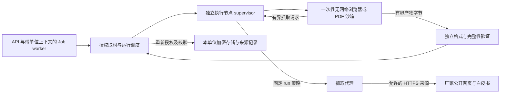

# 契约草案：不可信内容与工具执行沙箱

状态：**已实施，待真实隔离验收**。对应[路线图](roadmap.md#覆盖矩阵provider记忆看板agent-与-cli)
P03 Browser、A01，首先服务 B06 原型渲染和 B04 网页/白皮书采集。下文按推荐选项定义
拟实施边界；技术依赖、限额和产品选择集中在[已定决定](#已定决定)，不代表部署授权。

## 实施范围与已解决决定

| 范围 | 状态 | 实现与边界 |
| --- | --- | --- |
| 类型化 API/CLI、固定输入、作业与归档 | 已实施 | 入口、权限与来源关系见 [sandbox-execution.md](../notes/sandbox-execution.md)；数据库关口由 PostgreSQL 测试覆盖 |
| 无网络执行、独立验证与清理 | 已实施运行时适配，待真实验收 | Docker CLI 后端与测试假后端；默认关闭。测试开关与部署准备见[运行时指南](../guides/sandbox-runtime.md) |
| 厂家代理与来源回执 | 已实施 | 精确 URL 允许名单、固定 IP/TLS、持久单节点配额、拒绝摘要与归档；见 [sandbox-fetch.md](../notes/sandbox-fetch.md) |
| 控制通道 | 已实施，待实际节点验收 | 本地多 UID Unix socket；远程 TLS 1.3 双向证书验证、主机名校验与双端叶证书指纹固定。证书不进入容器 |
| 真实隔离与攻击验收 | 待执行 | macOS Colima 开发 VM 上 runc 合成模式的真实管道（mTLS、渲染与独立验证容器）已跑通；runsc 组合待下方决定后验收 |
| 运行时组合（待定） | 待决定 | gVisor 在 rootless Docker 下无法施加 cgroup 限额（报 systemd 权限错误，`--ignore-cgroups` 时 64 MiB 容器可分配 300 MiB）；rootful Docker + runsc 在专用 VM 内可施加限额。需在“rootful + runsc”“rootless + runc”“rootless + runsc 无限额”中选定，见[运行时指南](../guides/sandbox-runtime.md#prepare-a-macos-colima-development-vm) |
| Evidence/Card、生成模型、agent 编排 | 未实施，沿用相邻契约 | 本流提供已生成 HTML 的渲染和公开来源原始产物，不代行人工确认 |

实施时收敛的决定：

- 允许名单首个实现只支持精确规范化 URL，是批准路径范围的保守子集。维护方可通过
  文件里的 active revision 选择新提交策略；原修订不因新增修订自动撤销。
- 固定容器 CPU 上限下调为 1 vCPU，配合更短的组级硬期限和低配额周期，使累计 CPU
  不因终态采样间隔获得额外预算。资源计量精度和 daemon 终止延迟仍须真实验收。
- supplied HTML 的生成 job/provider/model 保留 null；首期不接受调用方自报生成模型。
  未来内部组合调用需单独接入已验证生成作业关系。
- 错误后的清理确认使用 supervisor 绑定回执；后续回收追加审计，不改写原失败事实。
  中断导致计量不完整时按剩余上界扣预算，不能据此重新得到完整执行额度。
- Playwright 只安装在固定隔离镜像内；PNG/PDF 验证复用 PyMuPDF，不给业务 worker
  新增浏览器或图像解码路径。准备镜像、Colima/Docker、runsc 与系统服务仅提供步骤，
  不属于本分支执行的部署动作。

## 目标与边界

建立可以强制终止、一次使用后销毁的执行环境，让 LLM 生成的单页 HTML、厂家网页及
白皮书即使包含恶意代码，也只能消耗批准的资源、读取本次明确交付的输入。产物经过
受控出口验证后才进入单位存储，保留来源、处理过程和实际字节哈希。

| 使用场景 | 首期输入与产物 | 网络与业务边界 |
| --- | --- | --- |
| 单页原型 | 已生成的 HTML 和内嵌资源 → Playwright 截图、渲染后 HTML、内部清单 | 完全无网络；来源性质只记内部溯源；不生成厂家材料 |
| 厂家页面 | 任务固定产品修订的官方 URL → 页面截图、DOM 快照、受限归档与请求清单 | 仅经抓取代理访问批准的公开来源；不带登录态、不执行表单业务操作 |
| 白皮书 | 固定产品修订的白皮书 URL → 原始 PDF 字节及显式指定页的 PNG | 代理下载后交给无网络 PDF 渲染沙箱；不猜页码、不自动 OCR、不执行 PDF 脚本或附件 |
| 后续内置 agent 工具 | 类型化工具调用 → 受限结果 | 本期预留调度、身份和费用边界；通用 shell、代码解释器、agent 编排均不启用 |

首期交付终点是可下载核验的**原始、尚未确认的输入产物**，以及可复用的 BrowserProvider/沙箱执行
边界。原型生成模型、搜索发现网址、视觉判定、Evidence/Card 新来源绑定属于各自后续
契约，不能用“沙箱完成”表示全部 B04/B06/A01 已交付。原型入口接收已有 HTML，不隐式
调用 LLM；以后 `ui mock` 可组合生成与渲染，仍分别留存用量与来源。

单位、凭据和人工关口遵循 [agent.md](../../agent.md#硬性规则任何情况下都不得违反)。
证据与响应的人工职责沿用 [ADR 0005](../adr/0005-human-confirmed-responses.md)及
[响应卡片机制](../notes/response-cards.md)。沙箱、代理、worker、内外部 agent 均不能
填写 `Evidence.confirmed_by`、修改已确认内容或导出。来源采集成功不等于真实性认证。

原型截图不加水印、烧入标签、固定页脚或任何可见“设计原型”标记；图片、预览、缩略图、
派生图、draft 和 export 均适用。`origin=prototype`、生成模型、HTML 哈希和渲染清单
只作内部溯源，不转成可见内容。这一展示边界不因通用规则引用而恢复旧的标记要求。

沙箱产物如何成为证据由 [screenshots.md](screenshots.md#图片成为响应证据的关口)定义，
本契约不设置按来源类型永久禁止 Evidence/draft/export 的条件。原型可像真实截图一样
用作证据，正式导出前由人作一次“保留或替换”决定；厂家页面和白皮书可经响应卡片的
人工确认流程成为证据。具体关联、人工决定及下游消费检查由 screenshots.md 和
[响应卡片确认关口](../notes/response-cards.md#how-it-works)负责；沙箱只提供原始输入，
不代行决定，也不额外增加一套沙箱确认流程。

与相邻计划的边界如下，未批准计划只作为待协调接口，不作为已存在能力：

- [screenshots.md](screenshots.md#取证溯源与哈希)的本机已登录系统截图仍在其本机隐私
  流程内；本沙箱不连接个人 Chrome、内网业务系统或既有会话。该计划默认不采 DOM/HAR，
  本提案的 DOM/归档仅限无登录态的公开厂家采集，不能扩大其敏感界面采集范围。
- [annotation.md](annotation.md#provider受权读取和本机输出)定义的 Rust 标注算法可供
  后续确定性处理复用，但本机子进程本身不是本提案的隔离实现；沙箱的格式和完整性
  验证不依赖标注 profile。
- [export.md](export.md#证据索引与-pdf-页附件)负责导出实现；沙箱产物的证据关联与消费
  资格交由 screenshots.md 和响应卡片确认关口判断，不在本契约另设来源类型禁入规则。
- [模型外发与遮挡](../notes/model-drafting-redaction.md)继续决定模型可以收到哪些文本。
  沙箱产物、HAR、DOM、PDF 和抓取文本不会自动加入模型输入；网页中的指令一律是数据。

## 威胁模型与可信边界

攻击者可以控制整个 HTML/JavaScript、远端网页/PDF/重定向/DNS、资源响应、文件名、
页面文字和伪造的输出清单。应假定 Chromium/PDF 解析器可能被攻破，甚至该次沙箱内的
驱动程序已被接管。LLM 的“安全检查”、DOM 清洗、CSP、浏览器 context 都不能单独充当
宿主隔离。保护目标包括数据库、凭据、其他单位及同单位未选资料、宿主文件和服务、
内部网络、云元数据、余额，以及服务可用性和人工确认关口。

可信计算基包括 API 授权/存储服务、固定 profile 的调度器、执行节点 supervisor、抓取
代理和选定隔离运行时；它们也必须最小授权。宿主管理员、宿主内核/虚拟化边界同时失陷
和所有微架构侧信道不能由此契约证明消除。采用独立执行节点、无业务凭据和网络隔离
缩小失陷影响，不能声称装了某个 runtime 就没有逃逸风险。



API/worker 在可信侧持有数据库和存储能力；执行节点不挂载这些服务的目录，不持有
数据库连接串、存储主凭据、加密主密钥、模型密钥或用户令牌。worker 授权读取后通过
有长度上限的输入流交付所选明文，不给沙箱对象存储签名链接。明文只在本次隔离临时
内存/卷内可见；这是显式输入边界，不允许沙箱自行按 ID 拉取单位资料。

调度器仅接受已验证、绑定 `org/job/attempt/input_hash/profile` 的内部运行描述，
不能接收调用方指定的 image、mount、环境变量、命令行、设备或网络模式。节点控制
凭据只在 supervisor，不能进沙箱环境；控制通道使用独立的双向认证和固定协议，
沙箱没有调度 API、队列 API、DB 或业务 API 访问能力。容器 daemon/socket 仅供执行
节点管理，不挂进 API、普通业务 worker 或沙箱，不与业务 Compose 网络混用。

### 运行时必须强制的限制

- 每次独立容器/隔离实例、非 root UID、只读根文件系统、私有 PID/IPC/mount/user/net
  边界；删除 capabilities、禁止提权，启用匹配浏览器的 seccomp 及适用 LSM 策略。
  不用 `--privileged`、`SYS_ADMIN`、host PID/IPC/network 或 `--no-sandbox` 放行兼容问题。
- 保留 Chromium 自身沙箱；私有 `/dev/shm` 计入内存限额，不用 `--ipc=host` 解决内存
  不足。浏览器与驱动在同一次隔离内以管道控制，无对外 CDP/WebSocket/调试端口。
- 不挂宿主根目录、home、项目树、Docker socket、SSH agent、云凭据、PG/Redis/MinIO
  卷；不共享可写缓存、下载目录或浏览器 profile。只有预置只读镜像与本次专有 tmpfs/卷。
  沙箱的 `/proc` 只描述本次隔离进程，不暴露宿主进程环境和其他运行。
- 固定运行镜像 digest、浏览器/PDF/字体版本、驱动与协议版本；依赖在构建时取得，
  运行时不执行安装器、包管理器、扩展下载或模型生成的 shell。限制掉 core dump，
  敏感临时内存不写宿主 swap；必须使用磁盘时采用一次性加密卷和单次密钥。
- 浏览器 API 禁用摄像头、麦克风、定位、剪贴板、文件选择、扩展、持久 service worker、
  任意下载、popup 和 WebRTC；这些只是纵深限制，底层网络与文件边界仍需独立生效。

## 按用途固定网络策略

建议浏览器沙箱两种用途都采用**无网络 namespace**。原型只有输入/输出字节通道；厂家
采集额外有一种固定的 `fetch` 消息，由 supervisor 转交抓取代理。浏览器驱动拦截所有
导航和资源请求，以代理响应字节履行请求；即使页面绕过 Playwright 拦截、接管驱动或
创建 raw socket，也没有直连外网/内网的路由。代理独立复验每个请求，不能信任驱动
已做检查。代理不是通用 HTTP CONNECT、SOCKS 或 TLS 透传服务。

| 用途 | 允许 | 必须拒绝 |
| --- | --- | --- |
| `prototype_offline` | 有界输入 HTML、内嵌 CSS/JS、受限 data/blob 资源、镜像内字体 | 所有网络 fetch/navigation、DNS、WebSocket、WebRTC、远程字体/图像、file/ftp 等协议；不从 CDN 补依赖 |
| `vendor_capture` | 代理代发与固定来源和策略匹配的 HTTPS GET/HEAD；PDF 字节下载 | 登录、Cookie/Authorization、POST/PUT/DELETE、请求体、CONNECT、任意查询参数、新来源发现、内网及云元数据 |
| 后续 `agent_tool` | 服务端工具白名单所选的独立 profile | 首期拒绝该用途；以后也不能因为 agent 需要某工具而授予通用网络 |

原型通过驱动把 HTML 作为内容注入，不启动宿主 HTTP server。网络请求被拒绝后记录
脱敏警示；只要声明的原型产物完整可生成，可返回成功并说明缺少外部资源。不能把离线
原型缺少资源解释为已验证其业务功能。任意外部资源需求须重新打包为受限内嵌资源。

厂家取证的策略由受信任维护方预置不可变 `network_policy_revision`，任务只引用该修订；
产品库的 URL 声明、模型建议、页面链接和 agent 不能创建或扩大允许名单。每次提交固定
`task_resource_id`、产品修订及 `official_url/whitepaper_url` 字段，首期只访问其中明确
选定的一个入口。子资源规则列出精确 origin、端口、路径范围、方法及允许的固定查询参数；
不允许 `*.vendor.com`、任意 CDN、任意 query 或跟随页面扩大域名范围。缺资源明确失败
或报告不完整，新增 CDN/path 须人工修订策略再新建运行，不在旧运行中自动追加。

抓取代理需在请求真正发出之前完成如下验证：

1. 使用同一 URL 解析器规范化 IDNA、端口、路径与编码，拒绝 userinfo、fragment、
   控制字符、歧义 IP 写法、凭据式查询参数和未批准协议。禁止页面把原型/材料文本塞入
   新 path/query/header；不转发客户端自定义头、Referer、Cookie、认证头或任意请求体。
2. DNS 仅由代理解析，每次连接检查全部 A/AAAA/CNAME 最终结果，混合公网/私网答案也
   拒绝；把通过检查的 IP 固定到实际 socket，保持原域名 SNI 与正常 TLS 校验。重连、
   重定向逐跳重验，不先验证一次再让 HTTP 客户端重新解析，阻止 DNS rebinding/TOCTOU。
3. 拒绝所有非公开可路由地址，包括回环、RFC1918、link-local、CGNAT、IPv6 ULA、
   IPv4-mapped IPv6、组播/保留地址，以及宿主网关、集群/服务网段、控制面和已知元数据
   端点。明确覆盖 `169.254.169.254`、`metadata.google.internal`、`host.docker.internal`；
   不只靠域名黑名单。代理网络层另无业务内网/元数据路由，仅准许所需的受控 DNS 出口。
4. 最多 5 次重定向，逐跳仍须策略允许；HTTPS 降级 HTTP、证书错误、登录页、验证码、
   不受支持的内容类型或到限的跳转不得作为成功证据。禁止自动登录、绕过验证码或提交
   同意/购买等表单。脚本发出的请求与主导航使用同一代理和字节预算。
5. 请求和响应流均有期限、数量、压缩前后字节上限；拒绝无限 chunk、压缩炸弹和超大
   Content-Length。到限立即断流和终止运行，不能下载完才检查。只保存批准的响应头
   字段，如 Content-Type/Length、ETag/Last-Modified；Set-Cookie 丢弃，不建立 cookie jar。

允许名单仍允许获准网站看见代理出口 IP、所访问的公开路径和时序，不能承诺没有这些
元数据外发。厂家沙箱只接收公开 URL 与渲染选项，不接收招标正文、原型、单位名称或
其他材料；代理内部的 run 关联信息不发送给厂家。即使允许域名本身恶意，也不能从本次
运行取得未交付的资料。策略变更/撤销时停止旧策略的新抓取，不能继续使用缓存授权。

## 资源限额与一次性生命周期

以下是已批准的服务端 profile 上限，部署可下调，调用方只能选择更小的视口或页集合。
提高上限必须形成新 profile 并重新验收，不能在同一次重试中移除限制。

| 限额 | 离线原型 | 厂家网页 / 白皮书 |
| --- | --- | --- |
| CPU | 2 vCPU 配额，累计 CPU 60 秒 | 2 vCPU 配额，累计 CPU 120 秒 |
| 内存、进程 | 1 GiB 硬上限，最多 128 进程/线程计数单位 | 2 GiB 硬上限，最多 128 进程/线程计数单位 |
| 实际运行 wall time | 60 秒 | 120 秒，包含抓取、渲染和产物流出 |
| 临时空间 / 私有 shm | 128 MiB / 128 MiB | 256 MiB / 128 MiB；两者均计入实例总内存/空间约束 |
| 输入 | HTML UTF-8 含内嵌资源最多 4 MiB | 单个 HTML 4 MiB、PDF 32 MiB；整个运行网络输入解压后 64 MiB |
| 页面/请求 | 1 tab、无 popup | 1 tab；最多 200 次请求含跳转/重试；最多 5 跳/链；同时请求最多 4 |
| 视口/图片 | 视口边长最多 4096、DPR=1；最终 PNG 每边最多 8192、总像素最多 20000000 | 同左；PDF 指定最多 10 页，固定 150 dpi，禁止自动缩小或省页 |
| 产物 | 单 PNG 40 MiB、DOM 4 MiB，总输出 64 MiB | 单 PNG 40 MiB、DOM 4 MiB、请求清单 4 MiB、归档 64 MiB，总输出 128 MiB |
| 诊断和协议 | 每种诊断流 64 KiB、控制消息 64 KiB、最多 32 个产物 | 同左；达到上限即停止接收，不让日志或无限产物耗尽 worker |

CPU 配额、内存和进程数量由 cgroup/隔离运行时执行，累计 CPU 与 wall time 由沙箱外的
supervisor 计量并终止。文件/网络/协议上限在相应流入口执行，图像声明尺寸、解码内存和
实际编码大小都须验证；不能靠 `asyncio.wait_for` 或 kill 单个浏览器进程留下子孙进程。
[Docker 资源限制文档](https://docs.docker.com/engine/containers/resource_constraints/)
说明了需要显式设置的容器限额；上表数值是本项目建议，须用实际 Chromium/PDF 链验收。

建议每单位同时最多 2 次运行、排队最多 20 次；节点同时最多 4 次，且按已保留内存决定
更低容量。抓取代理每 origin 最多 2 个并发连接，每单位最多每分钟 60 次请求。公平调度
防止一个单位占满节点；限额使用持久运行/租约与代理侧计数，不能只是单 worker 内计数。
排队超过 10 分钟以可重试失败结束，不占沙箱；作业跨重试最多 3 次新实例，限制不重置
模型调用预算。页面实际执行到限属于不可重试的输入/资源失败，不能自动换大机器循环。

生命周期须有可观测的终止与清理结果：

1. worker 取得作业租约，复核成员、任务/来源读取权限、固定输入/策略和费用门禁后，
   提交唯一 `(org_id, job_id, attempt_id)` 描述。supervisor 按该键幂等创建执行组，组内
   render/validate 阶段分别至多一个实例，重复派发不多开一份；先登记本地持久实例
   清单与硬到期时间，再允许执行。两个阶段顺序运行，共享同一个累计 CPU/wall/output
   预算，峰值内存不得超过 profile；验证阶段不能重新获得一份资源预算。
2. 创建新实例、私有临时空间和干净浏览器 context。只读输入流校验哈希后开始；不复用
   上次 cookie/cache/service worker、内存快照、输入卷或含业务数据的镜像层。
3. 达到完成、取消、租约丢失、心跳失败、超限或任何故障时，先封闭 fetch 和结果入口，
   撤销本次代理能力，再终止整个进程/cgroup/VM。wall deadline 独立于 DB 心跳，即使
   worker 被 SIGKILL、控制网络断开或数据库不可用也会到期终止。
4. 终止后 10 秒内确认进程和网络资源回收，移除临时卷/profile/shm/输入输出，销毁单次
   密钥；持久 reaper 每 60 秒核对孤儿。宿主重启先清理旧实例再接新工作。清理无法确认
   则标 `cleanup_pending`、隔离该节点容量并告警，不把残留实例提供给下一单位。
5. 正常完成的候选只有在结果完整核验、清理完成及当前 attempt/授权复核后才能归档为
   成功。清理失败可保留可信侧已加密的隔离候选用于恢复，但无下载入口。资源已计量、
   厂商已产生的费用不因取消/清理失败撤销。临时清理不删除历史证据、用量或审计。

## 产物流出、存储与溯源

沙箱没有业务存储写权限。驱动只通过固定帧协议输出 `ordinal/kind/length` 和字节流；
没有任意宿主路径、对象键、org、确认人、签名 URL 或 shell 指令字段。supervisor 按固定
产物集合和总预算接收，流中重算 SHA-256；沙箱自报的哈希、来源和成功状态都是待验数据。
禁止递归复制输出目录或在宿主解开沙箱提交的 tar/zip，拒绝 symlink、hardlink、设备、
路径穿越、重复 ordinal、超长帧、额外文件和 MIME 伪装。

不可信 PNG/PDF 的解码和验证在独立的无网络、有资源限制的验证实例中执行，
不在 API/worker 进程里解码。验证实例不执行来源 HTML/JS，只运行固定解析和校验程序；
可信接收侧核对文件头、长度、清单关联和最终字节哈希。主渲染实例与验证实例分别回收，
后者同样计入本次限额及运行成本。厂家网页截图不重绘正文、数值或印章；来源与原图/
派生图的父子关系保存在内部元数据中。

| 产物角色 | 必须保留的性质 | 读取边界 |
| --- | --- | --- |
| `prototype_png` | 保留渲染像素；内部溯源关联生成模型、输入 HTML 哈希和渲染清单 | 可受权预览和下载；证据用途由 screenshots.md 及其人工决定流程管理 |
| `rendered_html` | 渲染后 DOM UTF-8 字节；分别记录与输入 HTML/抓取原始响应的哈希 | 不在产品同源直接执行；作为不可信附件下载，不能把 DOM 当原始 HTTP 响应 |
| `capture_png` / `pdf_page_png` | 网页视口/裁剪信息，或白皮书真实页码、150 dpi、旋转和尺寸 | 采集时作为未确认输入，后续可经响应卡片人工确认成为证据；空白、登录/错误页不能伪称成功取证 |
| `source_pdf` | 代理实际取得的完整原始 PDF 字节及哈希 | 不在主站内嵌执行，只作受权附件；只请求几页不会伪称全部 PDF 已审阅 |
| `request_manifest` | 代理验证的请求、跳转、响应状态/允许头、时间、响应字节哈希、策略裁决 | 不包含凭据、Cookie、任意头或页面指令；精确 URL 存受权加密档案，审计只存摘要 |
| `capture_archive` | 可信归档器把已接收的公开响应字节与请求清单组成有界归档，固定条目名和内容哈希 | 不接受页面提供的归档文件作同等证明，不宣称是全部浏览会话或完整 WARC |
| `provenance_manifest` | 可信服务生成的内部 JSON，绑定固定输入、运行/策略、来源性质、全部有效载荷哈希和资源/清理回执 | 两种用途均必须生成，可经受权内部溯源接口核验；不作为图片、预览或 draft/export 的可见内容；不包含自己的文件哈希，数据库描述符另存其哈希 |

推荐首版默认 `archive=manifest`；调用方可显式选 `archive=bundle` 留存允许响应体。
不直接开启 Playwright 原始 HAR/trace/video，因为它们可能留存 Cookie、敏感头和无关
请求体。若以后需要 HAR，必须从代理白名单字段生成、标 `sanitized`、声明缺失字段及
响应体覆盖范围并另行批准，不能称为逐字完整 HAR。原始 DOM/页面正文仅存在受控输入
和加密产物，不进入普通诊断。发现敏感内容时停止公开预览并按后续隐私处置契约处理，
不能把“公开 URL”当作没有个人信息的保证。

原型的输入 HTML、渲染 DOM 和所有派生文件在内部元数据中保留 `origin=prototype`，
不把来源类型展示为标签或写入下载的 HTML。产品内只显示已验证 PNG，后续若提供交互
预览必须单独隔离 origin、无凭据、独立 CSP 和 iframe sandbox。下载后被修改的文件若
重新上传，按新字节计算哈希并保留已知来源关系，后续证据用途仍由 screenshots.md 管理。

可信侧的溯源清单至少记录：

- `org/task/document/extraction_job`、固定功能或产品选择及修订、输入来源类型；生成
  HTML 如来自后续模型作业，内部关联该 job/usage、实际生成服务商/模型与输出哈希；
  否则输入方式记 `supplied_html`，生成模型未知时为 null，不接受调用方自称模型名/
  生成时间作服务器证明。两种输入方式均保留 `origin=prototype`。
- 输入哈希、规范请求哈希、sandbox run/attempt、执行 image digest、runtime/浏览器/
  PDF/字体/驱动/profile/策略版本；视口、DPR、等待条件、指定 PDF 页和产物角色。
- 来源 URL、最终 URL 与逐跳链、代理 UTC 抓取开始/结束、状态/允许头、每个原始响应的
  SHA-256、渲染时间、最终 PNG/DOM/PDF/归档 SHA-256 和 bytes，父子变换及处理计划哈希。
  URL 不含凭据；精确地址只在授权档案内，普通列表只返回 origin、来源字段和 URL 哈希。
- 受信任 supervisor 的资源计量、终止原因、清理结果，以及代理观察与浏览器自报字段
  的区别。页面日期不能当抓取时间，hash 不能证明厂家真实性或未发生浏览器漏洞。

规范请求哈希使用验证后含显式默认值的 JSON，键排序、紧凑分隔符、ensure_ascii=true、
UTC 时间、无尾换行；有意义的数组顺序保持。文件哈希只对实际明文字节计算，不把自身
哈希写入被哈希文件制造循环。页面可能含时间、动画和动态数据，同输入只承诺固定渲染
配置与输入绑定，不承诺跨机器/浏览器版本/实时网站的相同 PNG 哈希。

对象键由可信服务构造，限定为 `org/{org_id}/sandbox-inputs/{input_id}/{sha256}` 和
`org/{org_id}/sandbox-artifacts/{run_id}/{attempt_id}/{artifact_id}/{sha256}`，复用现有
Storage 的加密和对象键绑定。读写均不得接受任意路径。按已验证字节先写不可覆盖对象，
再在短事务复核并写元数据/审计；失败可能留下加密孤儿，不能出现可下载的半份来源。
候选孤儿的专用前缀清理建议保留 24 小时后核对无引用才删除，禁止扫描清理其他业务前缀；
已归档来源的长期保留与删除另议，不把临时回收规则用于历史材料。

只发 300 秒签名链接，绑定 org、artifact、hash 和专用 kind；签发与实际下载都重新检查
当前身份/成员、任务和来源读权限、选择仍有效、策略未撤销。策略有新修订不自动撤销旧
修订；显式撤销会阻止旧产物新下载。HTML/PDF/归档按 attachment、nosniff 交付，原始
文件使用 `application/octet-stream`，不以 `text/html` 在应用 origin 内渲染。这里的
“无凭据”指文件不能取得应用凭据，下载本身仍须认证；原型/网页截图预览只返回已验证
PNG。客户端不跟随第三方跳转，核验
长度/哈希后原子写入新文件，拒绝覆盖、symlink 和路径替换。后台 job 查询不泄露输入
正文、内部键或下载签名；原型下载不等于业务 `export` 授权。

## 拟新增数据模型与单位隔离

下列业务表全部要求 **NOT NULL `org_id`**、`UNIQUE(org_id,id)`、ENABLE RLS、
**FORCE RLS**，策略同时有 USING/WITH CHECK；缺上下文不可读写。运行角色非属主、
无 SUPERUSER/BYPASSRLS，不能修改策略或删改历史。未来迁移必须同次带复合外键和
两单位隔离验收。沙箱运行时本身没有数据库角色，不能把 RLS 当作允许它连接 DB 的理由。

| 表 | 关键字段与约束 |
| --- | --- |
| `sandbox_inputs` | `task_id, document_id, extraction_job_id, purpose`；原型分支固定 `task_feature_id/feature_revision_id/html_sha256/size_bytes/object_key`，可选受服务验证的 `generation_job_id`；采集分支固定 `task_resource_id/product_revision_id/source_field/source_url_sha256/encrypted_source_url`。输入只追加；两分支互斥，URL 由固定修订解析 |
| `sandbox_runs` | `input_id, task_id, job_id, request_hash, profile, policy_revision, runtime_profile_digest, requested_by, actor_kind, token_id?, requested_at, capture_key?`；固定请求和授权范围快照不可改；同单位幂等键唯一；无 confirmer/export 字段 |
| `sandbox_attempts` | `sandbox_run_id, job_id, attempt_id, instance_group_ref_hash, started_at, ended_at, termination_code, cleanup_state, metrics`；唯一 `(org_id,job_id,attempt_id)`；保留 render/validate 的实例摘要与计量，组级累计限额不重置；仅 supervisor 回执经服务校验后推进，终态度量不可改，后续清理结果追加审计 |
| `sandbox_artifacts` | `sandbox_run_id, attempt_record_id, input_id, task_id, kind, ordinal, parent_artifact_id?, plaintext_sha256, size_bytes, media_type, object_key, created_at, provenance_manifest_hash`；PNG 加尺寸/PDF 页/变换描述，内部溯源保留 origin；采集或渲染完成时是未确认输入，Evidence 关联及确认状态由 screenshots.md 和响应卡片维护；同 attempt/kind/ordinal 唯一，不可改绑或覆盖 |
| `sandbox_fetch_receipts` | `sandbox_run_id, attempt_record_id, request_ordinal, parent_redirect_id?, url_sha256, encrypted_request_metadata, response_sha256?, response_bytes, status_code?, decision_code, policy_revision, started_at, ended_at, bundle_artifact_id?`；可信代理来源，拒绝请求只记安全摘要；可选复合外键指向本次 capture_archive，响应哈希/ordinal 与归档清单中的固定条目一致 |

上述 parent、input、run、attempt、job、task、Document、提取 job、TaskFeature/FeatureRevision、
TaskResource/ProductRevision、ApiToken 及可选生成 job 关系均采用含 `org_id` 的复合外键。
成员引用 `(memberships.org_id,user_id)`，不能只凭全局 User 存在即视为有本单位权限。
如父表缺所需唯一键，未来迁移一并补齐。跨任务也须防混绑：通过包含 task 的唯一键/
复合外键和数据库一致性关口，强制 Document、成功提取 job、选择、input、run 与产物
同一任务；JSON 清单不能替代可约束的关系。

将 `jobs.run_id` 统一称作 `attempt_id`，区别于稳定的 `sandbox_runs.id`。回执关联必须
同时匹配 org、job、attempt、input_hash、profile，不能只按 UUID 查找。每个作业 attempt
最多一个可发布的完整产物集合；部分文件、不匹配回执、旧 attempt 和取消后结果不可入库
为成功。产物父链限同任务/同来源，不能拿其他单位或其他来源的 PNG 替换。

固定输入与来源历史只追加；运行/清理状态仅受限服务可迁移，公开 API 不提供 PATCH。
发布时重新校验发起人有效 Membership、token 未过期及当前 scope 交集、当前选择/策略和
租约。选择替换、策略撤销、输入变化均要求新提交，不重写旧快照。旧归档可按当前权限
查询元数据并显示 `selection_active=false`，拒绝重新下载，不因此恢复材料消费资格。

## Pydantic 与 Provider 契约草案

以下保留批准的接口形状；实现与字段校验见 [sandbox_contracts.py](../../server/app/schemas/sandbox_contracts.py)。复用 [`Contract、Cost、Result`](../../server/app/schemas/contracts.py)
的 `extra=forbid`，由同一套 Pydantic v2 类型生成 API/CLI Schema。UUID/哈希/金额/时间
使用明确类型；新增能力不预先固定既有契约版本号。

```python
Sha256 = Annotated[str, Field(pattern=r"^[0-9a-f]{64}$")]
Purpose = Literal["prototype_offline", "vendor_capture"]

class Viewport(Contract):
    width: int = Field(default=1440, ge=320, le=4096)
    height: int = Field(default=900, ge=240, le=4096)
    device_scale_factor: Literal[1] = 1

class PrototypeSpec(Contract):
    purpose: Literal["prototype_offline"]
    extraction_job_id: UUID
    task_feature_id: UUID
    expected_feature_revision_id: UUID
    html_sha256: Sha256
    html_size_bytes: int = Field(gt=0, le=4 * 1024 * 1024)
    viewport: Viewport = Field(default_factory=Viewport)

class VendorSpec(Contract):
    purpose: Literal["vendor_capture"]
    extraction_job_id: UUID
    task_resource_id: UUID
    expected_product_revision_id: UUID
    source_field: Literal["official_url", "whitepaper_url"]
    expected_source_url_sha256: Sha256
    format: Literal["web", "pdf"]
    pdf_pages: list[int] = Field(default_factory=list, max_length=10)
    viewport: Viewport = Field(default_factory=Viewport)
    archive: Literal["manifest", "bundle"] = "manifest"
    capture_key: UUID

RunSpec = Annotated[PrototypeSpec | VendorSpec, Field(discriminator="purpose")]

class SandboxSubmit(Contract):
    spec: RunSpec
    expected_request_hash: Sha256 | None = None
    dry_run: bool = False
    retry: bool = False

class SandboxIssue(Contract):
    code: str = Field(pattern=r"^[a-z0-9_]{1,100}$")
    severity: Literal["block", "warning"]
    object_ids: list[UUID] = Field(default_factory=list)

class SandboxMetrics(Contract):
    wall_ms: int = Field(ge=0)
    cpu_ms: int = Field(ge=0)
    peak_memory_bytes: int = Field(ge=0)
    input_bytes: int = Field(ge=0)
    network_bytes: int = Field(ge=0)
    output_bytes: int = Field(ge=0)
    request_count: int = Field(ge=0)

class SandboxPreview(Contract):
    dry_run: Literal[True] = True
    request_hash: Sha256
    purpose: Purpose
    profile: str
    policy_revision: str
    ready: bool
    issues: list[SandboxIssue]
    estimated_cost: Cost
    estimate_basis: Literal["no_vendor_call", "upper_bound", "unknown"]
    reserved_charge: Decimal | None = Field(default=None, ge=0)
    charge_currency: str | None = None
    estimated_duration_ms: int | None = Field(default=None, ge=0)

class SandboxArtifactView(Contract):
    id: UUID
    run_id: UUID
    attempt_id: UUID
    kind: Literal["prototype_png", "capture_png", "pdf_page_png",
                  "rendered_html", "source_pdf", "request_manifest",
                  "capture_archive", "provenance_manifest"]
    sha256: Sha256
    size_bytes: int = Field(gt=0)
    media_type: str
    width: int | None = Field(default=None, gt=0)
    height: int | None = Field(default=None, gt=0)
    page: int | None = Field(default=None, ge=1)
    parent_artifact_id: UUID | None = None
    provenance_manifest_hash: Sha256

class SandboxProvenance(Contract):
    origin: Literal["prototype", "public_web_capture", "public_pdf_capture"]
    generating_job_id: UUID | None = None
    generating_provider: str | None = None
    generating_model: str | None = None
    html_sha256: Sha256 | None = None
    render_manifest_sha256: Sha256

class SandboxRunView(Contract):
    id: UUID
    org_id: UUID
    task_id: UUID
    job_id: UUID
    purpose: Purpose
    request_hash: Sha256
    profile: str
    policy_revision: str
    selection_active: bool
    state: Literal["queued", "running", "validating", "succeeded",
                   "failed", "cancelled", "cleanup_pending"]
    attempt_id: UUID | None
    cleanup_state: Literal["not_started", "pending", "complete", "failed"]
    artifacts: list[SandboxArtifactView]
    metrics: SandboxMetrics | None
    issues: list[SandboxIssue]
    usage_ids: list[UUID]
    charge: Decimal | None = Field(default=None, ge=0)
    charge_currency: str | None = None

class SandboxDownloadLink(Contract):
    artifact: SandboxArtifactView
    url: str
    expires_in: Literal[300] = 300

class SandboxDownloadReceipt(Contract):
    artifact: SandboxArtifactView
    output_path: str
```

字段间验证必须覆盖：整数严格校验且 bool 不冒充数值；字符串不可空白；时间带时区；
PNG 宽高非空且服从总像素限制，PDF 页只在页图非空。`format=pdf` 必须提供去重、有序、
正整数页集合，拿到 PDF 后核验真实页数；web 时页集合为空。入口类型与实际 MIME/魔数
不符失败，不悄悄从 HTML 登录页转成 PDF 或取第一份下载附件。

`SandboxProvenance` 仅作为内部溯源清单的类型化字段，不作为预览标签或 draft/export
内容。prototype 必须有实际输入的 html_sha256；生成 job/provider/model 由可信作业
记录解析，外部提供 HTML 且无法核验生成模型时保留 null。`SandboxArtifactView` 只描述
原始产物，不携带永久未确认状态、确认人或导出资格断言；关联 Evidence 的实际状态及
消费资格由 screenshots.md 和响应卡片确认关口提供，不通过修改原始文件表示人工决定。

`provenance_manifest` 与请求清单各至多 4 MiB，所有清单、归档封装开销和验证阶段输出
计入总产物上限。manifest 为必需项，绑定其他产物描述符；它自身的描述符引用数据库
保存的同一 manifest 哈希，不把自引用写进 JSON。`state=succeeded` 必须同时满足
`cleanup_state=complete`、无 block、必需产物齐备；其他状态的 artifacts 不暴露候选。

prototype 请求使用 multipart 的受限 `html` 字节流加 `SandboxSubmit` JSON；采集只有
JSON，不接受 HTML 上传。服务重算长度/哈希，prototype HTML 必须有效 UTF-8。客户端
不能指定 org、actor、generation job、profile/策略、来源 URL、环境、脚本或存储键。
生成作业的可信关联仅由后续内部组合入口提供。`dry_run` 不接受 retry，真实提交必须
提供匹配的预检 `expected_request_hash`，预检不伪造 run/artifact ID。

`capture_key` 表示一次明确采集意图，由调用方提供并在网络重试时沿用；同 key 配不同
参数返回冲突。重新取网页最新内容需新 key，不能永久复用 URL 的第一次截图，也不能因
客户端重发就额外抓一次。原型按单位、发起人、HTML/选择哈希、视口和 profile 幂等。
重试仅对失败/取消且清理完成的同一固定运行开放，不更换原输入或累计预算。

内部接口拟为 `BrowserProvider.render_prototype(authorized_input, profile)` 与
`BrowserProvider.capture(authorized_source, profile)`，返回有界 artifact 流与类型化
回执；由 `SandboxExecutor.execute(run_descriptor, input_streams)` 执行一次实例。
`cancel(instance_ref)` 与 `reap()` 只对 supervisor 自己创建的实例生效。Provider 适配位于
`server/app/providers/`，业务服务只依赖协议；二进制字节不放进 Result/base64 JSON。
受权输入、代理策略和控制上下文只由可信服务构造，公开模型不能直接变成内部运行描述。

BrowserProvider 的回执只提交候选、浏览器版本/观察和结束原因；来源 URL/时间/响应
哈希由代理记录，资源消耗由 supervisor 记录，单位/任务/确认状态由业务服务设置。
各自不可互相覆盖。适配器失败沿用
[`ProviderFailure`](../../server/app/providers/base.py)，仅输出固定安全错误码。

## CLI、API 与身份

建议先提供两种明确用途的 `sandbox` 命令供首批调用方接入，再由未来 `ui mock` 和
`evidence fetch` 在服务层复用。没有 `sandbox exec --command` 或传入任意容器参数的入口。

| CLI | API | 结果 |
| --- | --- | --- |
| `bid sandbox render --task T --html FILE --input PLAN.json [--dry-run] [--retry] [--wait] --json` | `POST /tasks/{T}/sandbox-runs`，multipart | 只接受 PrototypeSpec；SandboxPreview / SandboxRunView |
| `bid sandbox capture --task T --input PLAN.json [--dry-run] [--retry] [--wait] --json` | 同路径，JSON | 只接受 VendorSpec；SandboxPreview / SandboxRunView |
| `bid sandbox list --task T --json` | `GET /tasks/{T}/sandbox-runs` | 本单位任务运行列表，可分页 |
| `bid sandbox show --id R --json` | `GET /sandbox-runs/{R}` | 运行、清理、产物描述与脱敏问题 |
| `bid sandbox download --artifact A --output NEW --json` | `GET /sandbox-artifacts/{A}/download-link`，随后受权 download 路由 | SandboxDownloadLink → 核验后的 SandboxDownloadReceipt |
| `bid job status/wait/cancel J --json` | 复用既有 job 路由 | 状态、取消及费用，不暴露私有输入或绕过 sandbox 权限 |

新增拟 scope `sandbox:render`、`sandbox:capture`、`sandbox:read`，前两者建议授予有效
admin/bidder/technical，viewer 只有 read。调用还要求 `task:read`、固定功能/产品的
`resource:read` 及所选提取作业的 `job:read`；取消另需 `job:cancel`。令牌仅可显式申请
上述范围且与当前成员角色取交集，旧令牌不自动扩权。内置 agent 保留 agent 身份，
以发起人当前可用范围的子集执行，不能冒充 session。

不存在、跨单位或无权资源统一 404；缺认证 401、缺动作权限 403，执行前后均校验成员/
令牌有效性。平台运营身份不因此获得单位来源访问权。网络策略维护不是上述 scope，
没有允许 agent 改策略或给自己加内网目标的路由。本地 CLI 也经本机 PG/RLS
服务与隔离执行节点，不允许退回直接在宿主启动浏览器。

Result 顶层严格为 **`ok、command、data、items、warnings、cost、duration_ms`** 七键。
详情/提交/下载回执放 data，items=[]；列表放 items，data 只含分页范围。错误使用
`data.error.code` 与必要标识，`warnings` 只含脱敏原因；CPU/内存/存储计量和 charge
放类型化 data，不往现有 Cost 随意增加字段。成功文件流可以为二进制，错误在流开始前
返回 Result；断流不能变成成功或半份最终文件。

例如，首期无厂商调用的采集在代理门禁拒绝时，CLI 输出以下结构并退出 4；耗时是实际
测量值，错误内容不回显目标查询参数或页面文本：

```json
{
  "ok": false,
  "command": "sandbox capture",
  "data": {"error": {"code": "sandbox_network_denied"}},
  "items": [],
  "warnings": [],
  "cost": {"llm_tokens": 0, "ocr_pages": 0, "usd": 0},
  "duration_ms": 18
}
```

| 退出码 | 语义及本提案适用情况 |
| --- | --- |
| 0 | 预检通过、已受理、正常历史查询，或完整渲染/采集/核验下载成功；queued 不等于已有截图 |
| 2 | 缺参、非法 JSON/UTF-8/页码/视口、输入超限、哈希/修订/capture_key 冲突、来源不匹配、已有输出路径；修正输入后再提交 |
| 3 | 队列/节点暂不可用、可重试代理连接故障、启动失败、排队超时、清理尚待恢复；只在固定次数和期限内重试 |
| 4 | 身份/权限失败、策略拒绝、沙箱逃逸尝试、执行 CPU/内存/wall 限制、输出完整性失败、已取消、来源永久不可用；不自动放宽限制 |
| 5 | 保留统一的“部分成功”语义，首期单输入单运行不产生此结果；以后批量接口只有独立完整成功项与明确失败项并存才可使用，须另立契约 |

单次厂家取证缺必需页面/归档、超限或有未允许子资源时整次失败，无可用的半份证据。
原型被阻止的外部资源按离线规则警示，不是“取得了半份真实证据”。`--wait` 与 job status
对终态返回同一失败分类，非终态状态查询返回 0 并明确 state；`cleanup_pending` 不报
succeeded。错误 `ok=false`，单纯历史列表/详情查询可为 0，但不能抹去其失败/清理状态。
HTTP 输入 400/422、冲突 409、资源 404、临时故障 503/429 对应上述语义；协议内意外异常
统一安全错误码/退出码 4，不输出本地 traceback 或裸 exit 1。

`--dry-run` 做相同授权、输入哈希、静态策略、配额和已知价格检查，**不解析外网 DNS、
不抓取、不启动浏览器、不排队、不写业务/审计/用量/对象**。无法预知网站内容、最终大小
或耗时时返回 null，不用预检证明页面可达。命令不交互询问；CLI/API 输入、Result 和
`bid schema` 同步，既有命令输出保持，不兼容变化遵守主版本规则。

## 作业派发、调用准入与费用

新增 `jobs.kind=sandbox_render/sandbox_capture`，不改现有 kind 的行为。沿用
[`Job`](../../server/app/models/entities.py) 的非空 `document_id`：从明确选择、同任务
成功的 extraction job 解析真实招标 Document。功能/产品选择都必须属于该任务。首版
不支持无招标文件的独立 playground，不伪造 Document，也不把白皮书塞进招标文档外键。
任务无文档的通用 agent 工具作业须先有独立 Job 关联契约，不能在本切片放宽为空。

复用[后台作业](../notes/background-jobs.md)的业务 job 先提交再派发、锁定领取、单位
上下文、独立心跳、租约、`run_id` 和取消机制。网络/渲染/存储 I/O 不持长期业务行锁；
最终短事务重验固定输入、当前权限和 attempt。旧 attempt 可以完成真实费用结算，不能
发布产物、覆盖新 attempt 状态或恢复取消。重复派发、worker 崩溃和 DB 暂不可用均由
持久实例标识与 supervisor 硬期限限制，不留无人管理的长期浏览器。

费用区分以下三类，不增设余额表或另一套扣费系统：

| 工作 | 准入及记账 |
| --- | --- |
| 首期本地 Playwright/PDF、公开网页抓取和验证 | 同 Job 执行/配额守卫；记录 supervisor 资源指标，Cost 为零模型调用，不创建虚构模型 token 或空 UsageRecord，不扣预付模型余额 |
| 上游 HTML 生成或后续 agent 的 LLM/Vision/OCR/Search 调用 | 仅 Provider 层发出，每次含重试必须经 `JobExecution.admit` / `accounted_call`，复用 vendor_calls、UsageRecord 和 prepaid settlement；输出被拒或取消仍保留费用 |
| 未来收费远程浏览器/抓取代理或计算售价 | 首期禁用；先定义单位、单价版本、可强制的数量/期限和每次费用上界，再复用同一 vendor-call 准入与预付结算。不得把非 token 能力伪装成 LLM 目录行以启用收费 |

“零模型费用”不表示 CPU、代理出口或存储免费。上游生成费只记原模型作业，sandbox
视图可关联其 usage IDs，但本作业 cost 不重复汇总；纯本地运行余额为零仍可执行。
USD 是供应商成本，`charge` 是平台结算币种金额，未知供应商成本为 null 而非捏造 0。

凡真正计费的调用，必须遵守
[预付费准入与支出上界](../notes/prepaid-billing.md#admission-and-the-spending-bound)：
发送前持久化预约，锁 job 后锁单位余额，以余额减所有未结预约计算可用额，并核验累计
调用数、已结费和未结预约的作业上限。价格未知拒绝收费调用；每次重试新 call_id，
同一次结算重放仍用原 `(org_id,job_id,run_id,call_id)`，余额明细不重复扣减。

模型的 token 预约仍由现有 adapter 计算，不能套给浏览器时间/网络字节；将来按计算收费
需以 supervisor 能强制的上限和已批准价目计算 R，再接同一 admission。结果取得后先
结算再解释/发布；超 R、记账失败停止后续调用，未知结果保留预约等待对账，不能因租约
到期、实例销毁或取消就释放。当前没有自动对账命令，本提案不暗示增加该能力。
调用契约及重试细节以 [llm-providers.md](../notes/llm-providers.md) 和
[`calls.py`](../../server/app/providers/calls.py) 为依据。

复合生成/渲染流程未来若使用子 job，不能通过反复创建子作业重置支出上限；必须先定义
父执行预算与子调用归属。本期只接收现成 HTML，不实现该预算协调，也不宣称落实路线图
C03 的任务级预算。首期运行次数、网络、CPU 和输出限额仍对所有身份生效。

## 技术选项与建议

这里是拟选架构及需要验证的条件，不记录某台机器是否安装了运行时或生产版本。

| 选项 | macOS 开发 | Linux 生产与代价 |
| --- | --- | --- |
| 独立普通容器 + Playwright | 在专用 Linux VM 内可验证无网络、输入/输出和限额；不得共享宿主目录 | 与宿主共享 Linux 内核，单独 Docker 容器不作为多租户不可信执行的最终边界 |
| gVisor `runsc` + 一次性浏览器容器 | 在专用 Linux VM 中使用与生产一致的 profile，先验证架构/浏览器兼容性 | 建议首选；用户态应用内核减少宿主接口暴露，保留 OCI 工具链；有系统调用兼容及性能成本 |
| Firecracker microVM + jailer | 需要 Linux/KVM 环境，不能当作 macOS 原生进程方案；有条件时在专用 Linux 开发节点验证 | 可为每次运行提供独立 guest kernel；需管理内核、根盘、网络、jailer、清理和调度，运维范围更大 |
| 商业远程浏览器服务 | 可免本机浏览器安装 | 首期不选；须另审隔离、驻留、保留期、凭据、网络限制和费用上界，不能仅替换 URL 就接入 |

gVisor 的隔离方式与兼容性边界见[官方架构说明](https://gvisor.dev/docs/)，执行节点和
网络部署参照[生产指南](https://gvisor.dev/docs/user_guide/production/)。据此建议 Linux
生产使用专用执行节点上的 `runsc`，不承载数据库/API，不接业务私网；镜像只是浏览器
载体，实际边界包含 runtime、宿主权限、代理和资源限额。若选定 CPU 架构、Chromium
自身沙箱与 `runsc` 组合不通过隔离验收，保持功能关闭，调整方案后重新批准，不能自动
降到普通 runc 或关闭浏览器沙箱。

macOS 建议专用 Colima/Linux VM，不挂载 home、项目或其他宿主目录；输入输出通过
受限流通道。普通 OCI 开发 profile 只允许合成测试内容并显式标明保证较弱；面对真实
不可信输入，使用通过验收的 `runsc` VM/profile 或专用 Linux 执行节点。开发工具选择
不改变本地模式的 PG/RLS 契约，不能连接日常浏览器会话。

[Playwright Docker 文档](https://playwright.dev/docs/docker)明确指出其发布镜像面向
测试/开发，不能直接视为访问不可信网站的安全沙箱。该文档中的 root、host IPC 或增加
capability 的便利配置不能照搬到本契约；需构建固定版本的非 root runner、验证 Chromium
沙箱与私有 shm 后使用。[Firecracker 入门要求](https://github.com/firecracker-microvm/firecracker/blob/main/docs/getting-started.md)
及 [jailer 边界](https://github.com/firecracker-microvm/firecracker/blob/main/docs/jailer.md)
作为后续独立 guest kernel 方案依据。本提案不凭启动速度宣传值选型，先以相同攻击用例、
终止/回收行为和可承受吞吐做比较。引入 gVisor/Firecracker 属新增重要依赖，随本契约批准
后才准备实现与部署，不随本文安装或更改机器配置。

## 后续内置 agent 工具边界

后续 A01 将模型编排、授权服务和不可信工具执行分开：模型看到的页面/PDF/工具输出
都标为不可信数据，不能修改系统提示、工具 Schema、允许来源、预算、审批或确认状态。
模型供应商请求仍在可信 Provider 接入层发出，密钥不进入代码沙箱。工具结果进入下一次
模型请求前重新套用显式来源白名单、长度上限和既有遮挡规则。

工具调度只接收注册的 `tool_name + typed_arguments + input_refs`，服务端从当前发起人
权限解析输入并选定 profile。隔离实例没有通用 `bid` 登录态；如需要业务动作，实例只能
提出类型化意图，由沙箱外工具 broker 再走原 API/CLI 服务授权、审计与预算，不透传任意
HTTP、SQL、shell 或环境。worker/agent 身份在整个链保留，不能继承人的确认/导出权。

允许新增的工具必须列明读取集合、外部副作用、网络策略、输出格式、费用上界、取消和
恢复方式；即便在沙箱内也不自动获得发邮件、写外站、安装软件或创建新工具的权限。
多步工具共享业务状态只能通过受权存储中的显式工件，不能靠复用带数据的容器；父执行
累计预算和可恢复编排另立契约。上述约束是 A01 的接入条件，本期不发布 agent 工具入口。

## 审计与滥用响应

复用单位 `audit_logs`，事件拟为 `sandbox.submitted/started/completed/failed/cancelled`、
`sandbox.network_denied/resource_limit/cleanup_failed/reaped`、
`sandbox.artifact_download_link_issued/download_served`。保留真实 actor_kind、用户/
token、org/task/job/run/attempt、输入/文件/策略/profile 哈希、固定原因代码、计量与
关联 ID；代理回执与业务成功审计不能由沙箱自己写。成功归档与审计同一事务，失败和拒绝
单独记录失败事件；清理重试可追加事件，不能改写成此前已经清理成功。

普通日志、审计、费用、错误、任务列表不得含原始 HTML/JS、页面/模型输出、完整 URL
query、抓取头、Cookie、Authorization、凭据、报价、身份证号、银行账号或签名链接。
console/异常文本也由攻击者控制，默认只记计数、hash 和类型，不因诊断流有上限就允许
其原文进入日志。检测使用合成 canary，不在测试输出中使用或暴露真实秘密。

| 滥用或攻击 | 拒绝点与预期结果 |
| --- | --- |
| HTML/网页用提示注入要求读取密钥、确认 Evidence 或导出 | 页面指令不成为工具权限；无敏感输入/凭据/业务网络；后续 broker 拒绝非授权动作 |
| fetch、图片 URL、字体、DNS/WebRTC 或允许域名 query 外传 | 原型无网络；采集代理独立校验 origin/path/query/method，记录摘要且不发出违规请求 |
| 私网/元数据 SSRF、重定向、DNS rebinding | 解析到连接及每次跳转复验，网络层禁止目标；命中即失败，无绕过重试 |
| fork bomb、JS 无限循环、Wasm 挖矿、巨大 canvas/DOM/PDF | CPU/pids/内存/像素/deadline 硬限额，外部 supervisor 杀整个实例，其他单位继续运行 |
| 页面自造截图、回执、存储路径或确认字段 | 固定帧/Schema、可信来源记录、hash/关系校验；不把页面生成文字当厂家参数真实性认证 |
| 残留进程、浏览器缓存、临时文件串单位 | 一次性实例和卷、回收确认、重启 reaper；未清理节点停接新任务 |
| 恶意 PNG/归档攻击接收方、HTML 下载触发存储 XSS | 解码留在独立验证沙箱；固定归档器、attachment/nosniff、主站不执行不可信内容 |
| 大量免费渲染、同 URL 并发抓取、无限重试 | 单位/节点/origin 配额与跨 attempt 上限；模型费用仍在原准入账本，缓存不跨单位 |

## 批准后的端到端验收

建议顺序为 Schema/授权与关系约束 → 离线原型渲染与完整性验证 → 代理和公开网页/PDF →
作业恢复/资源计量 → 下载/隔离攻击验收。每一步通过实际 CLI/API、真实队列 worker、
隔离 runtime 和存储走通；不以 mock SandboxExecutor 或计划文字证明已隔离。
本节保留完整验收条件；实际已交付范围和待执行项见[实施范围与已解决决定](#实施范围与已解决决定)。

1. **首批入口与工件**：合成任务、成功提取 job、固定功能/产品修订经 render/capture
   真实入口到 worker，再下载核验 PNG/DOM/PDF，受权核验内部清单。原型 origin、生成
   模型关联、源 HTML 与渲染 DOM 哈希分别正确；网页来源、重定向与代理收到字节匹配；多页 PDF 只输出
   指定真实页，页数/截图像素可复核。缺页/哈希不符不产生半份成功归档。
2. **双单位数据库与接口**：固定 A/B 两单位，逐表、逐端点、job、产物父链、URL 回执、
   下载链接测试 A 访问 B 与未知资源均 404；无 org 上下文无行可读写。用受限 DB 角色
   尝试跨 org 复合外键、同 org 跨 task/提取/产品/功能修订混绑、修改历史、伪确认字段
   均拒绝。列表和统计也不泄漏另一单位存在性，不能只测 SELECT。
3. **文件/秘密边界**：在隔离测试宿主、另一单位对象和未选同单位资料放不同合成 canary。
   攻击 HTML 及专用攻击镜像尝试 `/proc` 环境、host mount、symlink、路径穿越、daemon/
   SSH socket、设备、容器运行时和实例外文件；无 canary 被读出。验证沙箱环境没有
   DB/模型/存储凭据，无业务服务连接，控制 API/CDP 不对沙箱或公网开放。
4. **原型无网**：主动尝试 HTTP(S)、fetch/sendBeacon、img/CSS/font、DNS、WebSocket、
   WebRTC、service worker、popup、file URL、IPv4/IPv6 raw socket。以网络 namespace
   外的包计数和合成接收端证明零网络包外发，不以页面 console 报错代替证据。
5. **代理攻防**：受控测试源提供允许域、恶意 query/path、userinfo、编码 IP、内网/
   元数据目标、混合 A/AAAA、DNS 重绑定、跨域和 HTTPS 降级跳转、无限 redirect、TLS
   错误、Cookie、POST、压缩炸弹、超长 chunk。证明只有批准请求到达合成目标，违规
   目标收到零请求；DNS 校验后的实际连接不被二次解析替换。攻击驱动直接伪造 fetch
   消息也不能绕过代理，不只覆盖正常 Playwright 请求。
6. **配额和资源耗尽**：通过 JS/Wasm 无限循环、进程炸弹攻击镜像、超大 canvas/DOM、
   畸形/超大 PDF、stdout 洪水、无限下载和输出帧，触发每项批准限额。测量实际 CPU/
   RSS/pids/磁盘/网络/墙钟，执行到限停止全部进程，正常 B 单位作业仍完成；内存/日志
   不能转移到可信 API/worker/代理造成同等耗尽。
7. **生命周期破坏**：运行中取消、租约过期/接管、worker SIGKILL、supervisor 重启、
   DB/控制网络断连、存储/归档失败逐项注入。验证硬期限独立生效、无旧 attempt 发布、
   重复派发每阶段只一实例、两个阶段累计限额、10 秒正常回收和 60 秒孤儿巡检按约执行。
   无法确认清理时节点停接，
   产物不可下载；下一次实例看不到前次 canary、cookie、缓存、临时卷或内存快照。
8. **输出与浏览器二次执行**：伪造 kind/大小/hash、重复 ordinal、超多产物、归档路径
   穿越、MIME 混淆、PNG 解码炸弹都被拒绝。下载恶意 HTML/PDF/归档不在主应用 origin 执行脚本、不带
   主站 Cookie；对象存储只含本单位加密字节，无永久公开地址。
9. **人工关口与身份撤销**：token/agent/worker 试图确认、重开受保护卡片或进入 export
   被拒绝。沙箱产物交给 screenshots.md 的证据流程：原型与真实截图一样可关联证据，
   正式导出前由人作一次保留或替换决定；厂家页面和白皮书经响应卡片人工确认后可作为
   证据。消费链的正向验收归属 screenshots.md；沙箱验收核对来源/哈希交接和不能代行
   人工决定，不按 prototype 来源一律拒绝。排队/执行/下载前停用成员、撤销 token、
   替换选择/策略，授权及时失效；旧签名/旧 job 不能成为旁路。
10. **费用与幂等**：本地运行零模型调用、零空 UsageRecord，记录资源消耗且不重复记
    上游生成费。未来组合调用用 Provider 假实现验证先预约再请求、并发余额扣预留、
    取消/拒绝仍结算、重复结算仅一次、未知结果保留预约、retry 不清预算。没有非 token
    价目契约时收费浏览器明确拒绝。相同 capture_key 不二次抓取，新 key 才新采集；
    dry-run 零网络、零执行、零持久写入。
11. **契约与复验产物**：核验本地/远程的 Result 七键、所有适用退出码、schema、错误
    脱敏和下载原子落盘；首期无 partial 场景，不为了覆盖 exit 5 伪造部分成功。保存
    可重复的合成输入/攻击用例、运行命令、策略/镜像 digest、产物哈希清单、截图、代理
    决策摘要、边界外包计数、资源峰值、清理前后实例列表及 JUnit/机器可读结果到独立
    `artifacts/` 或临时验收目录，不写入 `docs/`。攻击结果需明确 pass/fail/skipped，
    未具备目标 runtime 的跳过不能作为生产隔离通过。

CI 外部模型/计费厂商 Provider 用假实现，本地 BrowserProvider 和隔离 runtime 必须真实
执行；网络攻击使用隔离网络内的合成源/接收端，不访问真实
厂家、真实云元数据或真实秘密。测试源由测试专用策略映射，生产的私网拒绝逻辑必须仍
单独验证，测试例外不得进入生产 profile。公开真实网站兼容性另放获授权的 evals，
不能以其截图成功替代攻击验收，也不在 CI 产生真实厂商费用。

## 明确不在范围内

- LLM 原型生成、搜索和视觉服务接入、自动判参数满足、伪造厂家页面/报告/证书、材料
  真实性认证，或把抓取成功当人工确认。
- 已登录网站、用户个人浏览器、内网系统/堡垒机采集、Cookie/凭据导入、验证码绕过、
  表单提交、购物/支付及外部系统写入；本提案不扩大 screenshots 的本机采集授权。
- 通用代码解释器、shell、任意 Playwright 脚本、任意镜像、包安装、MCP 工具运行、
  完整 A01 编排/父子预算、无招标 Document 的工具 job、持续容器或跨运行数据卷。
- 新 Evidence 来源确认和 Card 绑定、图片隐私放行链、Rust 通用标注完整实现、OCR、
  Word/PDF 导出范围变更、自动确认/导出；相邻计划按各自批准边界推进。
- 商业远程浏览器、计算/存储收费、自动费用对账、新充值/支付系统、单位自带模型配置、
  生产部署、真实密钥/网络策略修改、长期来源删除与备份清理；本文不授权执行这些操作。

## 已定决定

以下各项均按推荐方案批准。

原型无可见标记及证据用途交由 screenshots.md 管理的产品边界已经确定，不在本表。

| 决定 | 选项 | 推荐及理由 |
| --- | --- | --- |
| 首批交付范围 | ① 离线 HTML + 公开网页/PDF 原始输入产物；② 先只做离线 HTML，采集另批 | **①**，按依赖分阶段验收，同一执行边界覆盖两个已明确用户；证据消费由 screenshots.md 承接，不同时实现完整 ui mock/evidence fetch/agent |
| 生产隔离运行时 | ① 独立节点 gVisor；② Firecracker microVM；③ 普通容器仅作合成开发环境 | **①**，保留 OCI 工作流并强化宿主边界；兼容性不过则停止接入并评估②，③不承载生产不可信输入 |
| macOS 开发路径 | ① 无宿主挂载的专用 Linux VM，真实输入用验收过的 runsc；② 全部委托专用 Linux 执行节点 | **①**便于离线开发；架构/浏览器不兼容时选②，不回退宿主浏览器 |
| 采集网络形态 | ① 无网沙箱 + 有界 fetch 消息/代理；② 仅能连显式 HTTP 代理的专网沙箱 | **①**，即使绕过浏览器拦截仍无直连；②需追加 CONNECT/TLS/防直连全链验收且不能放宽 URL 策略 |
| 允许名单维护 | ① 首期受信任维护方发布版本化规则；② 人类单位管理员在平台上界内维护本单位规则 | **①**，不新增策略编辑权限入口；②需单独配置/复合约束/审计契约，agent 两案均不能扩权 |
| 归档默认 | ① 默认 manifest、显式 bundle；② 每次强制保存全部允许响应体；③ 后续提供脱敏 HAR | **①**，保留可追溯摘要并控制存储；②更利于离线复核但占用更大，③须明确删减字段且不能称完整会话 |
| 首期限额 | ① 上表 1/2 GiB、60/120 秒、64/128 MiB 输出、每单位并发 2；② 更低配额 profile 先试运行 | **①**作为验收上界，按实测可下调；任何方案都硬终止、不静默降采样/漏页/扩大资源 |
| 来源与任务约束 | ① 必须已有成功提取 job 和固定产品/功能选择；② 同时支持无招标的 playground | **①**，遵守 Job.document_id 和租户关系，不用占位文件；②先另立通用 job/输入归属契约 |
| 首期费用 | ① 本地运行只计资源、不收计算费；② 同期启用计算或远程浏览器售价 | **①**，已有模型调用继续预付准入；②须先定非 token 计价和上界，复用现有账本，不能只检查正余额 |
| 临时清理和孤儿保留 | ① 正常 10 秒回收、60 秒巡检、可信侧无引用加密候选保留 24 小时；② 更短候选保留期 | **①**，兼顾故障恢复与暴露时间；已归档历史不适用临时删除，两案清理失败均停止节点接单 |
| 原型/网页 HTML 的产品展示 | ① 首期 PNG 预览 + 不可信附件下载；② 同期增加隔离 origin 交互预览 | **①**，避免把存储内容带回主站执行；②另加浏览器来源/CSP/权限和再外发验收。两案均保持原型来源仅作内部溯源，不改变 screenshots.md 的证据使用规则 |
| 内置 agent 接入时机 | ① 本期只规定接入边界，A01 单独批准工具/预算契约；② 同期实现固定工具清单 | **①**，先验证两个实际负载的隔离和费用；②必须先列工具副作用和父子预算，不能以沙箱替代授权 |
