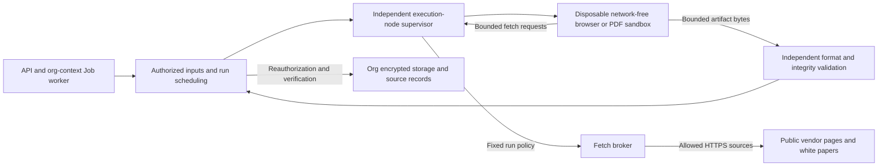

# Draft contract: sandbox for untrusted content and tool execution

Status: **Implemented; the runsc isolation acceptance subset on the macOS development node has passed, with full attack/proxy acceptance still pending**. Covers [roadmap](roadmap.md#coverage-matrix-providers-memory-dashboard-agent-and-cli) P03 Browser and A01, initially serving B06 prototype rendering and B04 web/white-paper capture. The contract below defines proposed implementation boundaries using recommended options; technical dependencies, limits and product choices reside in [Decisions](#decisions) and do not authorize deployment.

## Implementation scope and resolved decisions

| Scope | Status | Implementation and boundaries |
| --- | --- | --- |
| Typed API/CLI, fixed inputs, jobs and archives | Implemented | Entrypoints/permissions/source relationships: [sandbox-execution.md](../notes/sandbox-execution.md); PostgreSQL tests cover DB gates |
| Network-free execution, independent validation/cleanup | Runtime adapters implemented; real acceptance pending | Docker CLI backend/fake test backend; disabled by default. Test switches/deployment preparation: [runtime guide](../guides/sandbox-runtime.md) |
| Vendor (厂家) broker/source receipts | Implemented | Exact URL allowlist, pinned IP/TLS, persistent single-node quotas, rejection digests/archives; [sandbox-fetch.md](../notes/sandbox-fetch.md) |
| Control channel | Implemented; actual-node acceptance pending | Local multi-UID Unix sockets; remote TLS 1.3 mutual certificate verification, hostname checking and bilateral leaf-certificate fingerprint pinning. Certificates never enter containers |
| Real isolation/attack acceptance | Partially passed | Rootful Docker + runsc business-mode pipeline in the development VM, file/secret boundaries, zero network outbound including positive controls, CPU loops, memory bombs, caller disconnects/supervisor-restart reclamation passed via [sandbox_colima_acceptance.py](../../scripts/sandbox_colima_acceptance.py). Real vendor pages/white-paper PDFs passed capture/ingestion under development open policies. Proxy attack/defense (item 5) passed against real loopback TLS synthetic sources, including forged supervisor fetch frames, via [sandbox_proxy_acceptance.py](../../scripts/sandbox_proxy_acceptance.py); kernel egress filtering/real DNS on proxy nodes were excluded. Two-org interfaces (item 2) and running cancellation/worker SIGKILL lifecycle injections (item 7) passed on development with two synthetic orgs via [sandbox_two_org_acceptance.py](../../scripts/sandbox_two_org_acceptance.py). Lease-expiration takeover, database/control-network disconnection, storage/archive failure injections remain pending |
| Runtime combination | Decided | Rootful Docker + runsc inside a dedicated VM without host mounts/business credentials; runsc cannot use `--ignore-cgroups`/`--rootless`. Rootless is for runc synthetic mode only; [Decisions](#decisions) |
| Evidence/Card, generation models, agent orchestration | Not implemented in this slice; follow adjacent contracts | This stream renders already-generated HTML and provides raw public-source artifacts, without human confirmation (人工确认) |

Decisions narrowed during implementation:

- The first allowlist implementation supports exact canonical URLs only, a conservative subset of approved path ranges. Maintainers can select new submission policies using the file's active revision; adding revisions does not automatically revoke old ones.
- Fixed container CPU cap is lowered to 1 vCPU, with a shorter group hard deadline/low quota period preventing terminal-sampling intervals from adding cumulative CPU budget. Metering precision/daemon termination latency still need real acceptance.
- supplied HTML keeps generation job/provider/model null; first delivery rejects caller-declared generation models. Future internal composition separately integrates verified generation-job relationships.
- Post-error cleanup confirmation uses supervisor-bound receipts; later reclamation appends audit without rewriting original failures. Incomplete metering after interruption consumes the remaining upper-bound budget rather than restoring full allowance.
- Playwright is installed only in the fixed isolated image. PNG/PDF validation reuses PyMuPDF without new browser/image-decoding paths in business workers. Image/Colima/Docker/runsc/service preparation is documented as steps, not deployment actions executed in this branch.

## Goals and boundaries

Create an enforceably terminable, disposable execution environment where malicious LLM-generated single-page HTML, vendor pages and white papers can consume only approved resources/read only explicitly delivered inputs. Validate artifacts through controlled egress before org (organization/tenant, 单位) storage, retaining source/process/actual-byte hashes.

| Use case | Initial inputs and artifacts | Network/business boundary |
| --- | --- | --- |
| Single-page prototype (原型) | Already-generated HTML/embedded assets → Playwright screenshot, rendered HTML, internal manifest | Completely network-free; source nature recorded internally only; no vendor-material generation |
| Vendor page | Official URL from task-fixed product revision → page screenshot, DOM snapshot, limited archive/request manifest | Approved public sources through fetch broker only; no login state/business-form actions |
| White paper | Fixed-revision white-paper URL → original PDF bytes/explicitly requested page PNGs | Broker download then network-free PDF rendering sandbox; no guessed pages, automatic OCR, PDF scripts/attachments |
| Future built-in agent tools | Typed tool calls → restricted results | Reserve scheduling/identity/cost boundaries only; generic shell, code interpreter and agent orchestration disabled |

Initial delivery ends at downloadable/verifiable **raw, unconfirmed input artifacts** and reusable BrowserProvider/sandbox boundaries. Generation models, search URL discovery, visual judgment and Evidence/Card source binding belong to later contracts; sandbox completion does not establish all B04/B06/A01 delivery. Prototype input is existing HTML without implicit LLM calls; future `ui mock` may compose generation/rendering while retaining separate usage/source records.

Org, credential and human gates follow [agent.md](../../agent.md#hard-rules-must-never-be-violated). Evidence (证据)/response (响应) review domains (职责) follow [ADR 0005](../adr/0005-human-confirmed-responses.md) and [response-card mechanisms](../notes/response-cards.md). Sandbox/broker/worker/internal or external agents cannot fill `Evidence.confirmed_by`, modify confirmed content or export. Successful source capture is not authenticity certification.

Prototype screenshots carry no watermark, burned-in label, fixed footer or visible “设计原型” marker; this applies to images/previews/thumbnails/derivatives/draft/export. `origin=prototype`, generation model, HTML hash/render manifest are internal provenance only, never visible content. Generic-rule links do not restore old labeling requirements.

[screenshots.md](screenshots.md#gates-for-images-to-become-response-evidence) defines conversion to evidence; this contract imposes no permanent source-type prohibition on Evidence/draft/export. Prototypes may serve as evidence like real screenshots, with a human keep/replace decision before final export; vendor pages/white papers may become evidence through response-card human confirmation. Relationships, human decisions/downstream consumption are owned by screenshots.md and [response-card confirmation gates](../notes/response-cards.md#how-it-works); sandbox provides raw inputs without decisions or an extra sandbox-confirmation workflow.

Adjacent-plan boundaries follow; unapproved plans are coordination interfaces, not existing capabilities:

- [screenshots.md](screenshots.md#capture-provenance-and-hashes) local logged-in-system screenshots remain in its local privacy flow. Sandbox connects neither personal Chrome, intranet systems nor existing sessions. That plan defaults to no DOM/HAR; DOM/archives here apply only to public vendor capture without login, never expanding sensitive-UI capture.
- [annotation.md](annotation.md#provider-authorized-reads-and-local-output) Rust algorithms may support later deterministic processing, but local subprocesses are not this isolation implementation. Sandbox format/integrity validation does not depend on annotation profiles.
- [export.md](export.md#evidence-index-and-pdf-page-attachments) owns export implementation; screenshots.md/card gates determine artifact evidence relationships/eligibility, without extra source-type exclusions here.
- [Model outbound redaction](../notes/model-drafting-redaction.md) still determines model text inputs. Sandbox artifacts/HAR/DOM/PDF/fetched text do not automatically become model inputs; web instructions are always data.

## Threat model and trust boundary

Attackers may control all HTML/JavaScript, remote pages/PDFs/redirects/DNS/resource responses/filenames/page text/forged output manifests. Assume Chromium/PDF parsers may be compromised, even the sandbox driver may be taken over. LLM safety checks, DOM sanitization, CSP/browser contexts alone cannot isolate hosts. Protect databases/credentials, other orgs and unselected same-org materials, host files/services, internal networks/cloud metadata/balances, availability and human gates.

The trusted computing base includes API authorization/storage services, fixed-profile scheduler, execution-node supervisor, fetch broker and chosen isolation runtime, each with minimum privileges. This contract cannot prove elimination of host-administrator compromise, simultaneous host-kernel/virtualization compromise or every microarchitectural side channel. Independent nodes without business credentials/network isolation limit compromise impact; installing a runtime does not mean no escape risk.



API/workers retain DB/storage capability on the trusted side. Execution nodes mount none of those services' directories and hold no DB connection strings, storage master credentials, encryption master keys, model keys or user tokens. After authorization, workers deliver selected plaintext through bounded streams, not signed object-storage links. Plaintext is visible only in this run's isolated temporary memory/volumes; explicit delivery does not permit sandbox ID-based material retrieval.

Schedulers accept only verified internal descriptors bound to `org/job/attempt/input_hash/profile`, never caller images/mounts/environment/commands/devices/network modes. Node-control credentials stay in supervisor, not sandbox environment. Control channels have separate mutual authentication/fixed protocols; sandboxes cannot access scheduling/queue/DB/business APIs. Container daemon/socket is execution-node administration only, not mounted into API, ordinary workers or sandbox, nor shared with business Compose networks.

### Runtime-enforced restrictions

- Separate container/isolated instance per run, non-root UID, read-only root filesystem and private PID/IPC/mount/user/net boundaries; drop capabilities, prohibit escalation, enable browser-compatible seccomp/applicable LSM policies. Do not solve compatibility using `--privileged`, `SYS_ADMIN`, host PID/IPC/network or `--no-sandbox`.
- Retain Chromium sandboxing; private `/dev/shm` counts toward memory, not `--ipc=host` for shortages. Browser/driver use pipes inside the same isolation without public CDP/WebSocket/debug ports. The approved runsc vendor-renderer seccomp-bpf exception is limited as specified in [Decisions](#decisions).
- No host root/home/project/Docker socket/SSH agent/cloud credential/PG/Redis/MinIO mounts; no shared writable caches/downloads/browser profiles. Only preset read-only images and run-private tmpfs/volumes. `/proc` describes this instance only, not host-process environments/other runs.
- Fix image digest/browser/PDF/font/driver/protocol versions; obtain dependencies at build, never runtime installers/package managers/extensions/model-generated shell. Disable core dumps; sensitive temporary memory must not enter host swap. Necessary disk uses disposable encrypted volumes/single-run keys.
- Browser APIs disable camera/microphone/location/clipboard/file selection/extensions/persistent service workers/arbitrary downloads/popups/WebRTC. These are defense-in-depth; independent underlying network/file boundaries remain mandatory.

## Fixed network policy by purpose

Both browser purposes are recommended to use **network-free namespaces**. Prototypes have input/output byte channels only; vendor capture adds a fixed `fetch` message relayed by supervisor to the broker. The driver intercepts every navigation/resource request and fulfills it from broker bytes; pages bypassing Playwright interception, taking over drivers or opening raw sockets still lack external/internal routes. Brokers independently revalidate requests without trusting driver checks; they are not generic HTTP CONNECT/SOCKS/TLS tunnels.

| Purpose | Allowed | Must reject |
| --- | --- | --- |
| `prototype_offline` | Bounded HTML, embedded CSS/JS, limited data/blob resources, image-installed fonts | All network fetch/navigation/DNS/WebSocket/WebRTC, remote fonts/images, file/ftp protocols; no CDN dependency repair |
| `vendor_capture` | Broker HTTPS GET/HEAD matching fixed source/policy, PDF-byte download | Login/Cookie/Authorization, POST/PUT/DELETE/bodies/CONNECT, arbitrary query parameters/new-source discovery, intranet/cloud metadata |
| Future `agent_tool` | Independent profile from server tool allowlist | Reject initially; future tool needs still grant no generic network |

Drivers inject prototype HTML as content without host HTTP servers. Rejected network requests produce redacted warnings; complete declared prototype artifacts may succeed with missing external-resource warnings. Offline missing resources do not verify business functionality. External resources must be repackaged as bounded embedded resources.

Trusted maintainers preset immutable `network_policy_revision`; tasks reference revisions only. Product URL declarations/model suggestions/page links/agents cannot create/expand allowlists. Submission fixes `task_resource_id`, product revision and `official_url/whitepaper_url`; first delivery visits one explicitly selected entry. Subresource rules specify exact origin/port/path range/method/fixed query parameters, never `*.vendor.com`, arbitrary CDNs/queries or page-driven domain expansion. Missing resources fail explicitly or report incompleteness. Additional CDN/path requires human policy revision/new run, not automatic expansion in old runs.

Before issuing actual requests, brokers must:

1. Canonicalize IDNA/ports/paths/encoding with the same URL parser, reject userinfo/fragments/control characters/ambiguous IP notation/credential queries/unapproved protocols. Pages cannot insert prototype/material text into new path/query/header. Forward no client custom headers/Referer/Cookie/auth headers/arbitrary bodies.
2. Resolve DNS only in the broker; check all final A/AAAA/CNAME results for every connection, rejecting mixed public/private answers. Pin approved IPs to actual sockets while retaining original hostname SNI/normal TLS verification. Recheck reconnects/every redirect; do not validate once then allow client re-resolution, preventing rebinding/TOCTOU.
3. Reject every nonpublic routable address, including loopback/RFC1918/link-local/CGNAT/IPv6 ULA/IPv4-mapped IPv6/multicast/reserved addresses, host gateways/cluster/service networks/control planes/known metadata. Explicitly cover `169.254.169.254`, `metadata.google.internal`, `host.docker.internal`, beyond domain denylisting. Broker network separately lacks business-intranet/metadata routes, allowing necessary controlled DNS egress only.
4. At most 5 redirects, each policy-approved. HTTPS-to-HTTP downgrade, bad certificates, login/CAPTCHA/unsupported content/redirect exhaustion cannot become successful evidence. No automatic login/CAPTCHA bypass/consent-purchase forms. Script/main-navigation requests share broker/byte budgets.
5. Bound request/response deadlines/counts/compressed and decompressed bytes. Reject endless chunks/compression bombs/excessive Content-Length and stop streams/runs at limits, not after download. Retain only approved headers such as Content-Type/Length/ETag/Last-Modified; discard Set-Cookie, no cookie jar.

Approved websites can observe broker egress IP/public paths/timing; no promise of zero metadata disclosure. Vendor sandbox receives only public URL/render options, not tender documents (招标文件), prototypes/org names/materials. Internal run linkage is not sent to vendors. Even malicious allowed domains cannot obtain undelivered materials. Policy changes/revocation stop new fetches under old policy without cached-authorization continuation.

## Resource limits and disposable lifecycle

These are approved server-profile maxima; deployment may lower them and callers may only select smaller viewports/page sets. Raising limits needs a new profile/reacceptance, never removing limits during retry.

| Limit | Offline prototype | Vendor web / white paper |
| --- | --- | --- |
| CPU | 1 vCPU quota, cumulative CPU 60 seconds | 1 vCPU quota, cumulative CPU 120 seconds |
| Memory/processes | 1 GiB hard cap, at most 128 process/thread-count units | 2 GiB hard cap, at most 128 process/thread-count units |
| Runtime wall time | 60 seconds | 120 seconds including fetch/render/artifact egress |
| Temporary space/private shm | 128 MiB / 128 MiB | 256 MiB / 128 MiB; both count toward instance memory/space limits |
| Input | HTML UTF-8 including embedded resources at most 4 MiB | Single HTML 4 MiB/PDF 32 MiB; run-wide decompressed network input 64 MiB |
| Pages/requests | 1 tab, no popup | 1 tab, at most 200 requests including redirects/retries, 5 hops/chain, 4 concurrent requests |
| Viewport/images | Viewport side at most 4096, DPR=1; final PNG side at most 8192, pixels at most 20000000 | Same; at most 10 explicit PDF pages, fixed 150 dpi, no automatic resizing/omission |
| Artifacts | Single PNG 40 MiB/DOM 4 MiB, total output 64 MiB | PNG 40 MiB/DOM 4 MiB/request manifest 4 MiB/archive 64 MiB, total output 128 MiB |
| Diagnostics/protocol | Each diagnostic stream/control message 64 KiB, at most 32 artifacts | Same; stop receiving at limits so logs/endless artifacts cannot exhaust workers |

cgroup/runtime enforces CPU quotas/memory/processes; external supervisor meters/stops cumulative CPU/wall time. Stream ingress enforces file/network/protocol bounds; validate declared image dimensions/decoding memory/actual encoded size. `asyncio.wait_for` or killing only a browser while descendants survive is insufficient. [Docker resource constraints](https://docs.docker.com/engine/containers/resource_constraints/) describe explicit container limits; table values are project recommendations requiring actual Chromium/PDF-chain acceptance.

Recommend at most 2 concurrent runs/20 queued per org, 4 concurrent per node lowered by reserved-memory capacity; broker at most 2 connections per origin/60 requests per org per minute. Fair scheduling prevents monopolization. Persistent runs/leases/broker counts enforce limits, not one-worker counters. Queues over 10 minutes fail retryably without sandbox allocation. Jobs across retries get at most 3 new instances without model-budget resets. Execution limits are nonretryable input/resource failures, never automatic larger-machine loops.

Lifecycle requires observable termination/cleanup:

1. Worker acquires lease/rechecks member/task/source permissions/fixed inputs/policy/cost gates, submitting unique `(org_id, job_id, attempt_id)` descriptors. Supervisor creates an execution group idempotently, with at most one render/validate instance per phase; duplicate dispatch cannot add another. Register persistent local inventory/hard expiry before execution. Sequential phases share cumulative CPU/wall/output budget and peak memory cannot exceed profile; validation gains no fresh budget.
2. Create new instances/private temporary storage/clean browser contexts, starting after read-only stream hash checks. Never reuse cookie/cache/service worker/memory snapshot/input volume/business-data image layers.
3. Completion/cancellation/lease loss/heartbeat failure/overflow/any fault closes fetch/result ingress first, revokes broker capability, then terminates the entire process/cgroup/VM. Wall deadline is independent of DB heartbeats, expiring even after worker SIGKILL/control disconnect/database outage.
4. Confirm process/network reclamation within 10 seconds; remove volumes/profiles/shm/input/output/destroy single-run keys. Persistent reaper checks orphans every 60 seconds. Host restart cleans old instances before accepting work. Unconfirmed cleanup marks cleanup_pending, quarantines node capacity and alerts; residue cannot serve the next org.
5. Successful candidates archive only after complete validation/cleanup/current-attempt/authorization rechecks. Cleanup failure may retain trusted-side encrypted isolated candidates for recovery without download. Measured resources/incurred vendor cost survive cancellation/cleanup failure. Temporary cleanup never deletes historical evidence/usage/audit.

## Artifact egress, storage and provenance

Sandboxes have no business-storage write rights. Drivers emit only fixed-frame `ordinal/kind/length` and byte streams, without host paths/object keys/org/confirmers/signed URLs/shell fields. Supervisor receives a fixed artifact set within total budget, recomputing SHA-256; sandbox-declared hashes/sources/success are unverified. No recursive output copying or host unpacking of sandbox tar/zip; reject symlink/hardlink/devices/path traversal/duplicate ordinals/oversized frames/extra files/MIME disguise.

Untrusted PNG/PDF decode/validation executes in separate network-free resource-limited validation instances, never API/worker processes. Validators run fixed parsers/checkers, not source HTML/JS. Trusted receivers verify headers/length/manifest relationships/final hashes. Rendering/validation instances are independently reclaimed; both count toward limits/cost. Vendor screenshots do not redraw text/numbers/seals; source/original/derivative relationships remain internal metadata.

| Artifact role | Required properties | Read boundary |
| --- | --- | --- |
| `prototype_png` | Preserve rendered pixels; internal provenance links generation model/input HTML hash/render manifest | Authorized preview/download; evidence use governed by screenshots.md/human decisions |
| `rendered_html` | Rendered DOM UTF-8 bytes, separately hashed from input HTML/original fetched response | Never directly run same-origin; untrusted download, not original HTTP response |
| `capture_png` / `pdf_page_png` | Viewport/crop, or real PDF page/150 dpi/rotation/dimensions | Unconfirmed input at capture; may become evidence via human card confirmation. Blank/login/error pages cannot impersonate successful capture |
| `source_pdf` | Complete original PDF bytes actually obtained by broker/hash | Authorized attachment only, no main-site embedded execution; selected pages do not imply all PDF reviewed |
| `request_manifest` | Broker-verified requests/redirects/status/allowed headers/times/response-byte hashes/policy decisions | No credentials/Cookies/arbitrary headers/page instructions; exact URLs in authorized encrypted archives, audit digests only |
| `capture_archive` | Trusted archiver packages received public responses/request manifests into bounded archives with fixed names/content hashes | Page-supplied archives are not equivalent proof; no claim of complete sessions/full WARC |
| `provenance_manifest` | Trusted internal JSON binding fixed inputs/run/policy/source nature/all payload hashes/resource/cleanup receipts | Mandatory in both purposes, authorized internal verification only; invisible in images/previews/draft/export. No own hash inside content; DB descriptor stores it separately |

Recommend default `archive=manifest`, explicit `archive=bundle` retaining allowed response bodies. No raw Playwright HAR/trace/video that may retain Cookies/sensitive headers/unrelated bodies. Future HAR needs broker allowlisted fields, sanitized label, declared omissions/body coverage and separate approval, never a verbatim-complete HAR claim. Raw DOM/page text stays in controlled inputs/encrypted artifacts, not diagnostics. Sensitive findings stop public previews pending later privacy handling; public URL does not guarantee absence of personal data.

Prototype input HTML/rendered DOM/all derivatives retain internal origin=prototype without visible source labels/download-HTML insertion. Product displays verified PNG only. Future interactive previews need separate isolated origin/no credentials/independent CSP/iframe sandbox. Reuploaded modified files get new byte hashes/known source linkage; screenshots.md still governs evidence use.

Trusted provenance manifests retain at least:

- `org/task/document/extraction_job`, fixed feature/product selection/revision/input source type. Future model-generated HTML links internal job/usage/actual provider/model/output hash; otherwise supplied_html with unknown model null, never caller-declared model/time as server proof. Both retain origin=prototype.
- Input/canonical request hashes, run/attempt, image digest/runtime/browser/PDF/font/driver/profile/policy versions; viewport/DPR/wait conditions/PDF pages/artifact roles.
- Source/final URLs/redirect chain, broker UTC fetch start/end/status/allowed headers/raw response SHA-256, render time/final PNG/DOM/PDF/archive SHA-256 hashes/bytes, parent transformations/plan hashes. Credential-free exact URLs stay authorized; lists expose origin/source field/URL hashes only.
- Trusted supervisor resource/termination/cleanup receipts and distinction between broker observations/browser declarations. Page dates are not capture times; hashes prove neither vendor authenticity nor absence of browser vulnerabilities.

Canonical request hashes use validated JSON/explicit defaults/sorted keys/compact separators/ensure_ascii=true/UTC/no trailing newline, preserving meaningful array order. File hashes cover actual plaintext only, never circular self-hashes. Dynamic times/animation/data mean identical inputs promise fixed render configuration/input binding, not identical PNG hashes across machines/browser versions/live websites.

Trusted keys are `org/{org_id}/sandbox-inputs/{input_id}/{sha256}` and `org/{org_id}/sandbox-artifacts/{run_id}/{attempt_id}/{artifact_id}/{sha256}`, using existing Storage encryption/key binding; no arbitrary read/write paths. Write verified immutable objects first, then short-transaction recheck/metadata/audit. Failures may leave encrypted orphans, never downloadable partial sources. Recommend 24-hour retention then no-reference checks for candidate-specific orphan cleanup, never other business prefixes; long-lived archived-source retention/deletion is separate.

Only 300-second signatures binding org/artifact/hash/dedicated kind. Issuance/actual download recheck identity/membership/task/source read rights/selection/policy. New revisions do not automatically revoke old policies; explicit revocation stops new old-artifact downloads. HTML/PDF/archives use attachment/nosniff, originals application/octet-stream rather than application-origin text/html. Credential-free means files cannot obtain app credentials, while downloads remain authenticated. Prototype/web previews return verified PNG only. Clients reject third-party redirects, verify lengths/hashes and atomically write new files, rejecting overwrite/symlink/path replacement. Job queries expose no input bodies/internal keys/signatures; prototype download is not business export authorization.

## Proposed data models and org isolation

Every table requires **NOT NULL `org_id`**, `UNIQUE(org_id,id)`, ENABLE/**FORCE RLS**, policies with USING/WITH CHECK, no access without context. Runtime roles are non-owners without SUPERUSER/BYPASSRLS, cannot change policies/history. Future migrations jointly deliver composite foreign keys/two-org acceptance. Sandboxes have no DB role; RLS does not justify DB access.

| Table | Key fields and constraints |
| --- | --- |
| `sandbox_inputs` | `task_id, document_id, extraction_job_id, purpose`; prototype fixes `task_feature_id/feature_revision_id/html_sha256/size_bytes/object_key`, optional service-verified generation_job_id; capture fixes `task_resource_id/product_revision_id/source_field/source_url_sha256/encrypted_source_url`. Append-only/exclusive branches; fixed revisions resolve URLs |
| `sandbox_runs` | `input_id, task_id, job_id, request_hash, profile, policy_revision, runtime_profile_digest, requested_by, actor_kind, token_id?, requested_at, capture_key?`; immutable fixed-request/authorization snapshots, same-org unique idempotency keys, no confirmer/export fields |
| `sandbox_attempts` | `sandbox_run_id, job_id, attempt_id, instance_group_ref_hash, started_at, ended_at, termination_code, cleanup_state, metrics`; unique `(org_id,job_id,attempt_id)`; retain render/validate digests/metrics without resetting group limits; service-validated supervisor receipts alone advance state, final metrics immutable, later cleanup appends audit |
| `sandbox_artifacts` | `sandbox_run_id, attempt_record_id, input_id, task_id, kind, ordinal, parent_artifact_id?, plaintext_sha256, size_bytes, media_type, object_key, created_at, provenance_manifest_hash`; PNG dimensions/PDF page/transform, internal origin. Unconfirmed inputs at completion, Evidence linkage/state owned by screenshots.md/cards; same-attempt/kind/ordinal unique, no rebinding/overwrite |
| `sandbox_fetch_receipts` | `sandbox_run_id, attempt_record_id, request_ordinal, parent_redirect_id?, url_sha256, encrypted_request_metadata, response_sha256?, response_bytes, status_code?, decision_code, policy_revision, started_at, ended_at, bundle_artifact_id?`; trusted broker, safe rejection digests only, optional composite link to this capture_archive with response hashes/ordinals matching fixed entries |

Parent/input/run/attempt/job/task/Document/extraction job/TaskFeature/FeatureRevision/TaskResource/ProductRevision/ApiToken/optional generation job all use org_id composite foreign keys. Membership references `(memberships.org_id,user_id)`; global User existence alone is insufficient. Add missing parent unique keys with migrations. Task-containing unique/FKs/DB consistency enforce one task across Document/successful extraction/selection/input/run/artifacts; JSON manifests do not replace enforceable relationships.

Call `jobs.run_id` attempt_id consistently, distinct from stable sandbox_runs.id. Receipts must match org/job/attempt/input_hash/profile, not UUID alone. At most one publishable complete artifact set per attempt; partial files/mismatched receipts/old attempts/post-cancellation results cannot archive as success. Parent chains stay same-task/source, never substitute another org/source PNG.

Fixed inputs/source history are append-only; only restricted services transition run/cleanup state, no public PATCH. Publish rechecks initiator Membership, token expiry/current scope intersection, selection/policy/lease. Selection/policy/input changes require new submissions, not edited snapshots. Metadata for old archives may show selection_active=false under current permissions, but redownload is rejected and consumption eligibility is not restored.

## Draft Pydantic and Provider contract

Approved interface shapes follow; implementation/validation: [sandbox_contracts.py](../../server/app/schemas/sandbox_contracts.py). Reuse [`Contract, Cost, Result`](../../server/app/schemas/contracts.py) extra=forbid with shared Pydantic v2 API/CLI Schema. UUID/hash/money/time are explicit types; new capabilities do not preassign existing contract version numbers.

```python
Sha256 = Annotated[str, Field(pattern=r"^[0-9a-f]{64}$")]
Purpose = Literal["prototype_offline", "vendor_capture"]


class Viewport(Contract):
    width: int = Field(default=1440, ge=320, le=4096)
    height: int = Field(default=900, ge=240, le=4096)
    device_scale_factor: Literal[1] = 1


class PrototypeSpec(Contract):
    purpose: Literal["prototype_offline"]
    extraction_job_id: UUID
    task_feature_id: UUID
    expected_feature_revision_id: UUID
    html_sha256: Sha256
    html_size_bytes: int = Field(gt=0, le=4 * 1024 * 1024)
    viewport: Viewport = Field(default_factory=Viewport)


class VendorSpec(Contract):
    purpose: Literal["vendor_capture"]
    extraction_job_id: UUID
    task_resource_id: UUID
    expected_product_revision_id: UUID
    source_field: Literal["official_url", "whitepaper_url"]
    expected_source_url_sha256: Sha256
    format: Literal["web", "pdf"]
    pdf_pages: list[int] = Field(default_factory=list, max_length=10)
    viewport: Viewport = Field(default_factory=Viewport)
    archive: Literal["manifest", "bundle"] = "manifest"
    capture_key: UUID


RunSpec = Annotated[PrototypeSpec | VendorSpec, Field(discriminator="purpose")]


class SandboxSubmit(Contract):
    spec: RunSpec
    expected_request_hash: Sha256 | None = None
    dry_run: bool = False
    retry: bool = False


class SandboxIssue(Contract):
    code: str = Field(pattern=r"^[a-z0-9_]{1,100}$")
    severity: Literal["block", "warning"]
    object_ids: list[UUID] = Field(default_factory=list)


class SandboxMetrics(Contract):
    wall_ms: int = Field(ge=0)
    cpu_ms: int = Field(ge=0)
    peak_memory_bytes: int = Field(ge=0)
    input_bytes: int = Field(ge=0)
    network_bytes: int = Field(ge=0)
    output_bytes: int = Field(ge=0)
    request_count: int = Field(ge=0)


class SandboxPreview(Contract):
    dry_run: Literal[True] = True
    request_hash: Sha256
    purpose: Purpose
    profile: str
    policy_revision: str
    ready: bool
    issues: list[SandboxIssue]
    estimated_cost: Cost
    estimate_basis: Literal["no_vendor_call", "upper_bound", "unknown"]
    reserved_charge: Decimal | None = Field(default=None, ge=0)
    charge_currency: str | None = None
    estimated_duration_ms: int | None = Field(default=None, ge=0)


class SandboxArtifactView(Contract):
    id: UUID
    run_id: UUID
    attempt_id: UUID
    kind: Literal[
        "prototype_png",
        "capture_png",
        "pdf_page_png",
        "rendered_html",
        "source_pdf",
        "request_manifest",
        "capture_archive",
        "provenance_manifest",
    ]
    sha256: Sha256
    size_bytes: int = Field(gt=0)
    media_type: str
    width: int | None = Field(default=None, gt=0)
    height: int | None = Field(default=None, gt=0)
    page: int | None = Field(default=None, ge=1)
    parent_artifact_id: UUID | None = None
    provenance_manifest_hash: Sha256


class SandboxProvenance(Contract):
    origin: Literal["prototype", "public_web_capture", "public_pdf_capture"]
    generating_job_id: UUID | None = None
    generating_provider: str | None = None
    generating_model: str | None = None
    html_sha256: Sha256 | None = None
    render_manifest_sha256: Sha256


class SandboxRunView(Contract):
    id: UUID
    org_id: UUID
    task_id: UUID
    job_id: UUID
    purpose: Purpose
    request_hash: Sha256
    profile: str
    policy_revision: str
    selection_active: bool
    state: Literal[
        "queued", "running", "validating", "succeeded", "failed", "cancelled", "cleanup_pending"
    ]
    attempt_id: UUID | None
    cleanup_state: Literal["not_started", "pending", "complete", "failed"]
    artifacts: list[SandboxArtifactView]
    metrics: SandboxMetrics | None
    issues: list[SandboxIssue]
    usage_ids: list[UUID]
    charge: Decimal | None = Field(default=None, ge=0)
    charge_currency: str | None = None


class SandboxDownloadLink(Contract):
    artifact: SandboxArtifactView
    url: str
    expires_in: Literal[300] = 300


class SandboxDownloadReceipt(Contract):
    artifact: SandboxArtifactView
    output_path: str
```

Cross-field validation must cover strict integers without bool impersonation, nonblank strings and timezone-aware times. PNG dimensions are required and obey pixel caps; PDF page is non-null only for page images. `format=pdf` requires a deduplicated ordered set of positive page numbers, checked against actual page count after download; web requires an empty page set. MIME/magic mismatch fails rather than silently convert a login HTML page into PDF or select its first download.

SandboxProvenance is typed internal-manifest data, not preview labels or draft/export content. Prototypes require actual input html_sha256; trusted job records resolve generation job/provider/model, leaving null for externally supplied HTML whose model cannot be verified. SandboxArtifactView describes raw artifacts without permanent-unconfirmed state/confirmation/export-eligibility assertions; screenshots.md/cards supply actual Evidence states/eligibility, without changing original bytes to express decisions.

provenance_manifest/request manifests are each at most 4 MiB. All manifest/archive overhead/validation output count toward total output. Mandatory manifests bind other descriptors; their own descriptors reference the same DB-stored manifest hash without JSON self-reference. state=succeeded requires cleanup_state=complete, no block and all required artifacts; other states expose no candidate artifacts.

Prototype multipart accepts bounded html stream plus SandboxSubmit JSON; capture accepts JSON only, never HTML uploads. Servers recompute length/hash; prototype HTML must be valid UTF-8. Clients cannot choose org/actor/generation job/profile/policy/source URL/environment/scripts/storage keys. Only future trusted internal composition supplies generation-job links. dry_run forbids retry; actual submission requires matching preflight expected_request_hash, and preflight invents no run/artifact IDs.

capture_key is an explicit capture intent supplied by callers/reused on network retries; same key/different parameters conflicts. New capture of current web content needs a new key, without permanently reusing the first URL screenshot or fetching again on client resend. Prototype idempotency covers org/initiator/HTML-selection hashes/viewport/profile. Retry only permits failed/cancelled same-fixed runs after cleanup, without changing original inputs/cumulative budgets.

Proposed internal interfaces are `BrowserProvider.render_prototype(authorized_input, profile)` / `BrowserProvider.capture(authorized_source, profile)`, returning bounded artifact streams/typed receipts; `SandboxExecutor.execute(run_descriptor, input_streams)` runs one instance. cancel(instance_ref)/reap() affect supervisor-owned instances only. Adapters live in server/app/providers/, services depend only on protocols and binary bytes never enter Result/base64 JSON. Trusted services alone construct authorized inputs/broker policies/control contexts; public models cannot directly become internal descriptors.

BrowserProvider receipts submit candidates/browser versions/observations/termination reasons only. Brokers record source URLs/time/response hashes, supervisors resource use, business services org/task/confirmation state, without mutual overwrites. Adapter failures use [`ProviderFailure`](../../server/app/providers/base.py) and fixed safe codes only.

## CLI/API and identity

Recommend two explicit-purpose sandbox commands for initial consumers, later reused service-side by ui mock/evidence fetch. No sandbox exec --command or arbitrary-container-argument entrypoint.

| CLI | API | Result |
| --- | --- | --- |
| `bid sandbox render --task T --html FILE --input PLAN.json [--dry-run] [--retry] [--wait] --json` | `POST /tasks/{T}/sandbox-runs`, multipart | PrototypeSpec only; SandboxPreview / SandboxRunView |
| `bid sandbox capture --task T --input PLAN.json [--dry-run] [--retry] [--wait] --json` | Same path, JSON | VendorSpec only; SandboxPreview / SandboxRunView |
| `bid sandbox list --task T --json` | `GET /tasks/{T}/sandbox-runs` | Paginated org-task run list |
| `bid sandbox show --id R --json` | `GET /sandbox-runs/{R}` | Run/cleanup/artifact descriptors/redacted issues |
| `bid sandbox download --artifact A --output NEW --json` | `GET /sandbox-artifacts/{A}/download-link`, then authorized download route | SandboxDownloadLink → verified SandboxDownloadReceipt |
| `bid job status/wait/cancel J --json` | Existing job routes | Status/cancellation/cost without private-input disclosure or sandbox-permission bypass |

Proposed new scopes sandbox:render/capture/read: first two for valid admin/bidder/technical, viewer read only. Also require task:read, fixed feature/product resource:read and selected extraction job:read; cancellation adds job:cancel. Tokens may explicitly request these scopes intersected with current member roles, without automatic expansion of old tokens. Built-in agents retain agent identity and execute a subset of initiator-current scopes, never impersonate session.

Missing/cross-org/unauthorized resources uniformly return 404; missing authentication 401/action permission 403. Recheck membership/token before/after execution. Platform operators gain no org-source access. Policy maintenance is outside these scopes, with no agent policy-change/intranet-self-grant route. Local CLI uses local PG/RLS/services/isolated execution nodes, never direct host-browser fallback.

Result has exactly **`ok`, `command`, `data`, `items`, `warnings`, `cost`, `duration_ms`**. Details/submission/download receipts use data/items=[]; lists use items with pagination scope only in data. Errors use data.error.code/necessary IDs, warnings sanitized reasons only. Typed data contains CPU/memory/storage metrics/charge without arbitrary Cost fields. Successful file streams may be binary; errors return Result before streaming, and interruptions cannot become success/partial final files.

For initial capture with no vendor call, broker rejection emits this CLI structure with exit 4; duration is measured, and errors echo neither target query parameters nor page text:

```json
{
  "ok": false,
  "command": "sandbox capture",
  "data": {"error": {"code": "sandbox_network_denied"}},
  "items": [],
  "warnings": [],
  "cost": {"llm_tokens": 0, "ocr_pages": 0, "usd": 0},
  "duration_ms": 18
}
```

| Exit code | Meaning and application |
| --- | --- |
| 0 | Passed preflight/accepted job/history query or complete render/capture/verified download; queued is not an existing screenshot |
| 2 | Missing parameters/invalid JSON/UTF-8/pages/viewport, input limits/hash/revision/capture_key conflicts/source mismatch/existing output; correct inputs and resubmit |
| 3 | Queue/node temporarily unavailable/retryable broker connection/startup failure/queue timeout/cleanup pending recovery; retry within fixed count/deadline only |
| 4 | Identity/permission failure/policy rejection/escape attempt/execution CPU-memory-wall limit/output-integrity failure/cancelled/permanently unavailable source; no automatic relaxation |
| 5 | Reserved partial-success semantics; first delivery's single-input/run never produces it. Future batches require complete independent successes alongside explicit failures under a separate contract |

Missing required entry pages/archives or resource-limit violations fail the entire vendor capture without usable partial evidence. Under the subsequently approved incomplete-resource decision, failed/denied subresources may instead produce a marked capture after successful entry-document loading; authorization/policy changes still fail the run. Offline prototypes warn for blocked external resources, not partially acquired real evidence. --wait/job status share terminal failure classifications; nonterminal queries return 0 with explicit state, and cleanup_pending never reports succeeded. Errors have ok=false; history queries may return 0 without erasing failures/cleanup states. HTTP input 400/422, conflict 409, resource 404, temporary fault 503/429 follow these meanings. Unexpected protocol exceptions use safe codes/exit 4 without traceback/bare exit 1.

--dry-run performs identical authorization/input-hash/static-policy/quota/known-price checks, **without external DNS/fetch/browser startup/queueing/business-audit-usage-object writes**. Unknown website content/final size/duration is null, never preflight proof of reachability. Commands are noninteractive; CLI/API inputs/Result/bid schema stay synchronized, existing output remains unchanged and incompatible changes follow major-version rules.

## Job dispatch, call admission and costs

Add jobs.kind=sandbox_render/sandbox_capture without changing existing kinds. Retain [`Job`](../../server/app/models/entities.py) non-null document_id, resolving the actual tender Document from explicit same-task successful extraction. Feature/product selections must belong to the task. No initial tender-free playground, fabricated Document or white paper in a tender-document FK. Generic document-free agent jobs need a separate Job-relationship contract before any nullable relaxation.

Reuse [background jobs](../notes/background-jobs.md): commit business jobs before dispatch, locked claiming/org context/independent heartbeat/leases/run_id/cancellation. Network/render/storage I/O holds no long business locks; short final transactions recheck fixed inputs/current permissions/attempt. Old attempts may settle real cost but cannot publish, overwrite new state or undo cancellation. Persistent instance IDs/supervisor deadlines bound duplicate dispatch/worker crashes/temporary DB outages without unmanaged long-lived browsers.

Costs have three categories, without new balance tables/accounting systems:

| Work | Admission/accounting |
| --- | --- |
| Initial local Playwright/PDF/public fetch/validation | Same Job execution/quota guards; record supervisor resources, zero-model Cost/no fake tokens/empty UsageRecord/prepaid-model debit |
| Upstream HTML generation or future agent LLM/Vision/OCR/Search | Provider layer only; every call/retry uses JobExecution.admit/accounted_call, existing vendor_calls/UsageRecord/prepaid settlement; rejection/cancellation retains costs |
| Future paid remote browser/broker/compute prices | Disabled initially; first define units/price revisions/enforceable counts-deadlines/per-call upper bounds, then same vendor-call admission/prepaid settlement. Non-token capability cannot masquerade as LLM catalog rows |

Zero model cost does not promise free CPU/broker egress/storage. Upstream generation is charged only in its original job; sandbox views may link usage IDs without double-counting job cost. Pure local runs work with zero balance. USD is vendor cost, charge platform currency; unknown vendor costs are null, never invented 0.

Actual billed calls obey [prepaid admission/spending bounds](../notes/prepaid-billing.md#admission-and-the-spending-bound): persist reservations before sending, lock job then org balance, compute balance minus all unsettled reservations, and check cumulative call count/settled cost/reservations against job caps. Unknown prices reject paid calls; every retry gets new call_id, settlement replay retains `(org_id,job_id,run_id,call_id)` without duplicate debit.

Existing adapters compute model-token reservations, not browser time/network bytes. Future compute pricing calculates R from enforceable supervisor caps/approved pricing then same admission. Settle results before interpretation/publication; overshoot/settlement failure stops further calls, unknown outcomes retain reservations pending reconciliation rather than lease expiry/destruction/cancellation release. No current automatic reconciliation command is implied. Call/retry contracts: [llm-providers.md](../notes/llm-providers.md), [`calls.py`](../../server/app/providers/calls.py).

Future composition with child jobs cannot reset spending through repeated creation; define parent execution budgets/child-call ownership first. Initial slice receives existing HTML without budget coordination or claims of roadmap C03 task-level budgets. Run/network/CPU/output limits apply to every identity.

## Technical options and recommendations

These are proposed architectures/validation conditions, not machine-installation or production-version records.

| Option | macOS development | Linux production and cost |
| --- | --- | --- |
| Separate ordinary container + Playwright | Dedicated Linux VM can validate network-free inputs/outputs/limits, without shared host directories | Shares host kernel; Docker container alone is not the final multi-tenant untrusted-execution boundary |
| gVisor runsc + disposable browser container | Dedicated Linux VM uses production profile, first validating architecture/browser compatibility | Recommended first choice; user-space application kernel reduces host interfaces/retains OCI, with syscall/performance costs |
| Firecracker microVM + jailer | Requires Linux/KVM, not native macOS; validate on dedicated Linux development nodes where available | Separate guest kernel/run; manage kernels/root disks/network/jailer/cleanup/scheduling with larger operations scope |
| Commercial remote browser | Avoids local browser installation | Not initially selected; separate isolation/residency/retention/credential/network/cost-bound review, not mere URL replacement |

See [gVisor architecture](https://gvisor.dev/docs/) and [production guide](https://gvisor.dev/docs/user_guide/production/). Recommend dedicated Linux runsc nodes without DB/API/business-intranet access. Images carry browsers; boundaries include runtime/host permissions/broker/resource caps. Failed isolation acceptance for CPU architecture/Chromium sandbox/runsc combinations keeps the feature disabled pending revised approval, never ordinary-runc fallback or disabled browser sandbox.

Recommend dedicated Colima/Linux VM on macOS without home/project/other host mounts, bounded streams for I/O. Ordinary OCI development profiles allow synthetic content only with explicit weaker guarantees; real untrusted input requires accepted runsc VM/profile or dedicated Linux nodes. Tool selection leaves local PG/RLS contracts intact and cannot connect everyday browser sessions.

[Playwright Docker documentation](https://playwright.dev/docs/docker) says released images target testing/development and are not directly secure sandboxes for untrusted sites. Its convenience root/host-IPC/capability settings cannot be copied here. Build fixed non-root runners, validate Chromium sandbox/private shm. [Firecracker requirements](https://github.com/firecracker-microvm/firecracker/blob/main/docs/getting-started.md)/[jailer boundary](https://github.com/firecracker-microvm/firecracker/blob/main/docs/jailer.md) inform later separate-guest-kernel options. Select by identical attack/termination/reclamation/throughput tests, not startup-speed marketing. gVisor/Firecracker are substantial dependencies prepared for implementation/deployment only after contract approval; this document installs/configures nothing.

## Future built-in agent tool boundary

Future A01 separates model orchestration/authorization/untrusted execution: pages/PDFs/tool outputs are untrusted data and cannot change system prompts/tool Schema/allowed sources/budgets/approvals/confirmations. Model calls stay in trusted Providers with no keys in code sandboxes. Before subsequent model requests, reapply explicit source allowlists/length limits/existing redaction.

Tool scheduling accepts registered tool_name + typed_arguments + input_refs only, resolves inputs from current initiator permissions and selects profiles. Instances have no generic bid login state. Business actions require typed intents routed by an external broker through existing API/CLI authorization/audit/budget, not arbitrary HTTP/SQL/shell/environment passthrough. Worker/agent identity persists across the chain without human confirmation/export rights.

Every new allowed tool declares read sets/external side effects/network policy/output/cost bounds/cancellation/recovery; sandboxing grants no automatic email/external writes/installations/new tools. Shared multistep state uses explicit authorized-storage artifacts, not reused data-bearing containers. Cumulative parent budgets/recoverable orchestration need separate contracts. These are A01 prerequisites; no agent-tool entrypoint ships here.

## Audit and abuse response

Reuse org audit_logs; proposed events are sandbox.submitted/started/completed/failed/cancelled, sandbox.network_denied/resource_limit/cleanup_failed/reaped, sandbox.artifact_download_link_issued/download_served. Retain actual actor_kind/user/token/org/task/job/run/attempt, input/file/policy/profile hashes, fixed reason codes/metrics/correlation IDs. Sandboxes cannot write broker receipts/business-success audits. Successful archives/audit share transactions; failures/rejections have failure events; cleanup retries append, never rewrite earlier cleanup as successful.

Ordinary logs/audit/cost/errors/task lists contain no raw HTML/JS/page/model outputs/full URL queries/fetch headers/Cookies/Authorization/credentials/quoted prices/identity-card numbers/bank accounts/signatures. Console/exception text is attacker-controlled; default to counts/hashes/types, and diagnostic bounds do not permit raw logs. Detection uses synthetic canaries, never real secret exposure in test output.

| Abuse/attack | Rejection boundary and expected result |
| --- | --- |
| HTML/page prompt injection to read keys/confirm Evidence/export | Page instructions grant no tool permission; no sensitive inputs/credentials/business network, later brokers reject unauthorized actions |
| fetch/image/font/DNS/WebRTC/allowed-domain query exfiltration | No prototype network; broker independently checks origin/path/query/method, records digests and never sends violating requests |
| Private/metadata SSRF, redirect, DNS rebinding | Resolution-to-connection/every-hop rechecks plus network prohibition; immediate failure without bypass retries |
| Fork bombs/JS loops/Wasm mining/huge canvas-DOM-PDF | Hard CPU/pids/memory/pixel/deadline caps; external supervisor kills whole instance while other orgs continue |
| Page-forged images/receipts/paths/confirmation fields | Fixed frames/Schema/trusted sources/hash-relationship checks; page text is not vendor-parameter authenticity certification |
| Residual processes/cache/temp files crossing orgs | Disposable instances/volumes, confirmed cleanup/restart reaper; uncleared nodes reject new tasks |
| Malicious PNG/archive attacks, downloaded HTML storage XSS | Isolated validation decoding/fixed archiver/attachment-nosniff; main site never executes untrusted content |
| Excess free rendering/same-URL concurrency/endless retries | Org/node/origin quotas/cross-attempt caps; original model-admission ledger remains, no cross-org cache |

## End-to-end acceptance after approval

Recommend Schema/authorization/relationship constraints → offline rendering/integrity → broker/public web-PDF → job recovery/resource metering → download/isolation attacks. Each uses actual CLI/API/queue workers/runtime/storage; mock SandboxExecutor/plans cannot prove isolation. Complete acceptance remains here; implemented/pending scope is in [Implementation scope and resolved decisions](#implementation-scope-and-resolved-decisions).

1. **Initial entrypoints/artifacts**: synthetic tasks/successful extraction/fixed feature-product revisions use actual render/capture/worker/download, verify PNG/DOM/PDF/internal manifests. Prototype origin/model linkage/source HTML/rendered DOM hashes are separate/correct; web sources/redirects match broker bytes. Multi-page PDF yields only specified real pages with verifiable count/pixels; missing pages/hash mismatch cannot archive partial success.
2. **Two-org DB/interfaces**: A/B table/endpoint/job/parent/URL receipt/download tests give 404 for cross-org/unknown resources, no context means no reads/writes. Restricted roles reject cross-org FKs, same-org mixed task/extraction/product-feature revisions, historical changes/forged confirmation. Lists/statistics leak no other-org existence, beyond SELECT-only checks.
3. **Files/secrets**: distinct canaries in isolated host/other-org/unselected same-org materials. Attack HTML/images attempt /proc environments, host mounts/symlinks/traversal/daemon-SSH sockets/devices/runtime/outside files without canary reads. Sandbox lacks DB/model/storage credentials/business-service access; control API/CDP is unavailable to sandbox/public.
4. **Network-free prototypes**: actively attempt HTTP(S)/fetch/sendBeacon/img-CSS-font/DNS/WebSocket/WebRTC/service worker/popups/file URLs/IPv4-IPv6 raw sockets. Packet counts outside namespaces/synthetic receivers prove zero outbound packets; console errors are insufficient.
5. **Proxy attack/defense**: controlled sources cover allowed domains/malicious query-path/userinfo/encoded IP/private-metadata/mixed A-AAAA/rebinding/cross-domain-downgrade/endless redirects/TLS errors/Cookies/POST/compression bombs/endless chunks. Only approved requests reach synthetic targets; forbidden targets get none. Actual connections cannot be replaced by second resolution. Direct forged fetch messages also fail, beyond ordinary Playwright requests.
6. **Quotas/resource exhaustion**: JS/Wasm loops/process-bomb images/huge canvas-DOM/malformed-oversized PDF/stdout floods/endless downloads-frames trigger every cap. Measure CPU/RSS/pids/disk/network/wall; stop all processes at limits while normal org B jobs finish. Exhaustion cannot merely transfer into trusted API/workers/brokers.
7. **Lifecycle disruption**: inject running cancellation/lease expiry-takeover/worker SIGKILL/supervisor restart/DB-control disconnect/storage-archive failures. Hard deadlines act independently, no old-attempt publication, duplicate dispatch means one instance/phase, cumulative phase caps/10-second cleanup/60-second orphan checks hold. Unconfirmed cleanup stops node admissions/downloads; next instance cannot see prior canary/cookie/cache/temp volume/memory snapshot.
8. **Output/browser reexecution**: forged kind/size/hash, duplicate ordinals/excess artifacts/archive traversal/MIME confusion/PNG bombs reject. Downloaded malicious HTML/PDF/archives cannot execute at app origin/access app Cookies; storage holds org-encrypted bytes only without public permanent URLs.
9. **Human gates/revocation**: token/agent/worker confirmation/protected-card reopen/export attempts reject. Handoff to screenshots.md permits prototype Evidence like real screenshots with one human keep/replace before final export; vendor pages/PDFs become evidence via card confirmation. Positive consumption acceptance belongs to screenshots.md. Sandbox checks source/hash handoff/no delegated decisions, not blanket prototype rejection. Disable membership/revoke tokens/replace selection-policy before queue/execution/download; old signatures/jobs cannot bypass.
10. **Cost/idempotency**: local zero calls/empty UsageRecord, measured resources/no duplicate upstream costs. Future composition uses fake Providers to test reservation-before-call/concurrent balance minus holds/cancellation-rejection settlement/one-time settlement/unknown reservations/no retry budget resets. Paid browsers reject without non-token pricing contracts. Same capture_key never refetches; new key does. dry-run has zero network/execution/persistent writes.
11. **Contracts/repeatable artifacts**: verify both CLI modes' seven keys/all applicable codes/schema/redacted errors/atomic downloads; no initial partial scenario or invented exit 5. Save repeatable synthetic inputs/attacks/commands/policy-image digests/artifact hashes/screenshots/proxy decisions/outside packet counts/resource peaks/before-after inventories/JUnit-machine results to independent artifacts/temporary acceptance directories, not docs. Clearly mark pass/fail/skipped; missing-runtime skips cannot prove production isolation.

CI external model/billing Providers are fake, but local BrowserProvider/runtime execute for real. Network attacks use isolated synthetic sources/receivers, not actual vendors/cloud metadata/secrets. Test-only policies map sources; production private-address rejection remains separately verified and exceptions never enter production profiles. Authorized public-site compatibility evals are separate; screenshot success cannot replace attack acceptance or incur real vendor costs in CI.

## Explicitly out of scope

- LLM prototype generation/search/vision integration, automatic parameter satisfaction, fabricated vendor pages/reports/certificates, authenticity certification or capture success as confirmation.
- Logged-in sites/personal browsers/intranet-bastion capture/Cookie-credential import/CAPTCHA bypass/forms/shopping-payment/external writes; local screenshots authorization is not expanded.
- Generic code interpreters/shell/arbitrary Playwright/images/package installation/MCP tools/full A01 orchestration-parent-child budgets/document-free jobs/persistent containers/cross-run volumes.
- New Evidence-source confirmation/Card binding/image privacy release/full Rust annotations/OCR/Word-PDF export changes/automatic confirmation-export; adjacent plans follow their approvals.
- Commercial remote browsers/compute-storage billing/automatic reconciliation/new recharge-payment/BYOK/production deployment/real-key-network-policy changes/long-term source deletion-backup cleanup; this document authorizes none.

## Decisions

All items below were approved as recommended.

Unlabeled prototypes and evidence-use ownership by screenshots.md are settled product boundaries, not choices in this table.

| Decision | Options | Recommendation and rationale |
| --- | --- | --- |
| Initial delivery | ① Offline HTML/public web-PDF raw artifacts; ② offline HTML first, separate capture approval | **①**, phased dependent acceptance across two known consumers; screenshots.md owns evidence, without complete ui mock/evidence fetch/agent implementation here |
| Production runtime | ① Dedicated gVisor; ② Firecracker; ③ ordinary synthetic-development containers | **①**, retain OCI/stronger host boundary; failed compatibility stops integration/evaluates ②; ③ excludes production untrusted inputs |
| Runtime combination | ① Dedicated VM rootful Docker + runsc; ② rootless Docker + runc; ③ rootless Docker + runsc ignoring cgroups | **①** (approved after 2026-10-03 testing): rootless gVisor cannot enforce cgroups; ③ allowed 300 MiB allocation in a 64 MiB container. ② loses gVisor kernel isolation, synthetic development only. ① root daemon stays VM-local with no host mounts/business credentials; supervisor rejects rootless/cgroup-ignoring runsc |
| macOS development | ① Dedicated mount-free Linux VM, accepted runsc for real inputs; ② dedicated Linux execution node | **①** for offline work; incompatible architecture/browser uses ②, never host-browser fallback |
| Capture network | ① Network-free sandbox/bounded fetch broker; ② private sandbox connecting explicit HTTP proxy only | **①**, no direct route even after interception bypass; ② requires CONNECT/TLS/direct-route-prevention acceptance without weaker URL policies |
| Allowlist maintenance | ① Trusted-maintainer versioned policies; ② human org admins within platform bounds | **①**, no policy-edit scope; ② needs separate config/composite-constraint/audit contract; agents cannot expand either |
| Archive default | ① manifest, explicit bundle; ② mandatory all allowed bodies; ③ later redacted HAR | **①**, traceability/storage control; ② aids offline verification at more storage; ③ declares omitted fields, never complete sessions |
| Initial limits | ① Table's 1/2 GiB, 60/120 seconds, 64/128 MiB output, 2 concurrent/org; ② lower trial profile | **①** acceptance maxima, reducible after tests; both hard-terminate without silent downsampling/omission/resource expansion |
| Sources/tasks | ① Successful extraction/fixed product-feature selection required; ② tender-free playground too | **①**, Job.document_id/tenant relationships without placeholders; ② requires generic-job/input-ownership contract first |
| Initial cost | ① Local resources metered/no compute fee; ② compute/remote-browser prices now | **①**, existing model prepaid admission remains; ② requires non-token pricing/bounds/same ledger, not positive-balance checks alone |
| Cleanup/orphans | ① 10-second cleanup/60-second inspection/trusted unreferenced encrypted candidates 24 hours; ② shorter candidate retention | **①**, recovery/exposure balance; historical archives excluded, both stop node work on cleanup failure |
| Prototype/web HTML display | ① PNG preview/untrusted attachment download; ② isolated-origin interaction now | **①**, no main-site reexecution; ② requires origin/CSP/permissions/redispatch acceptance. Both keep source internal/screenshots.md use unchanged |
| Chromium vendor-renderer sandbox under gVisor | ① Disable renderer seccomp-bpf only for runsc vendor capture, retain namespace sandbox; ② disable for all gVisor rendering; ③ keep enabled/defer capture | **①** (approved after 2026-10-03 tests): gVisor renderer seccomp blocks other-thread sched_getaffinity, crashing script-heavy vendor pages. Disabling that layer retains gVisor/container seccomp/network-free/resource/Chromium namespace isolation. Prototypes retain full Chromium sandbox |
| Partial vendor-resource failures | ① Capture after entry-document load, log failed resources/mark vendor_resources_incomplete, require ingestion review; ② any failure fails all | **①** (2026-10-03 approval): slow/denied real-site resources make ② nearly unusable; failed entry/auth/policy changes still fail all |
| Built-in agents | ① Boundaries only, separate A01 tool/budget approval; ② fixed tools now | **①**, validate isolation/cost for two real workloads first; ② lists side effects/parent-child budgets before implementation, never sandbox as authorization |
